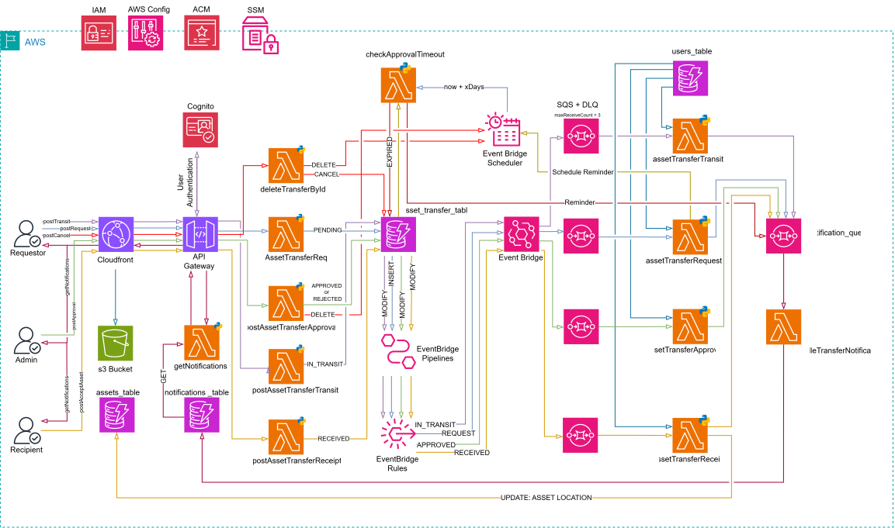
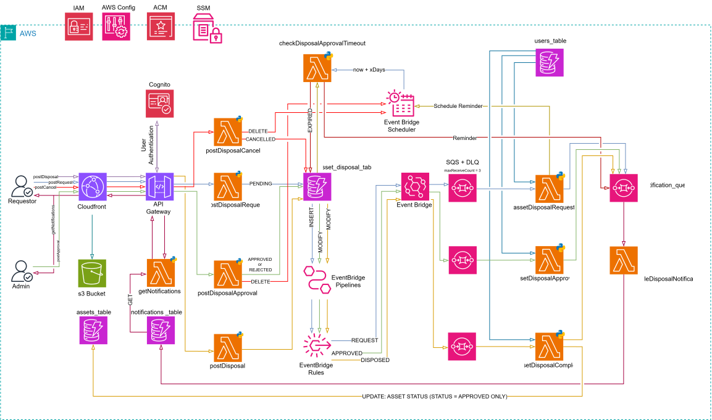
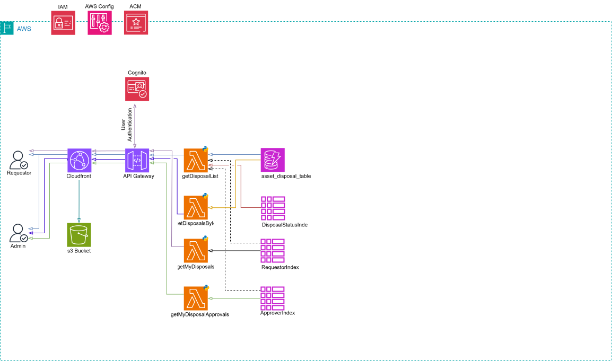

# Atlantic Meats Project

A custom-built asset and maintenance management system designed specifically for a Atlantic Meats to streamline the management of assets across multiple store locations. The platform centralises all maintenance activity into a single digital system, replacing manual WhatsApp tracking methods with structured, traceable job cards and a unified asset register.

It provides a consolidated view of all assets across stores, enabling clear visibility into maintenance history, ongoing work, and asset performance. Each maintenance action is recorded digitally, ensuring a complete and reliable history of work performed on every asset.

# Aim of the Platform

The primary aim is to reduce maintenance expenditure and improve the efficiency and accuracy of asset management across all customer store locations.

Key objectives include:

- Reducing overall maintenance spend through improved visibility and preventative insights
- Providing store-level and asset-level insights into maintenance activity and recurring issues
- Centralising asset management across all customer locations into a single system
- Replacing manual processes with digital job cards for consistent and traceable maintenance records
- Maintaining a complete maintenance history per asset to support troubleshooting and decision-making
- Identifying patterns and root causes of recurring faults to enable long-term corrective actions

# Table of Contents

- [Introduction](#introduction)
- [Tech Stack](#tech-stack)
- [Feautures](#features)
- [Project Structure](#project-structure)
- [Installation](#installation)
  - [Clone the Repository](#clone-the-repository)
  - [Navigate to the project](#navigate-to-the-project)
  - [Install Dependencies](#install-dependencies)
  - [Start Development Server](#start-development-server)
- [Environment Variables](#environment-variables)
- [Github Secrets](#github-secrets)
- [Available Scripts](#available-scripts)
- [Build](#build)
- [Deployment](#deployment)
- [EsLint Configuration](#eslint-configuration)
- [Usage](#usage)
- [API Reference](#api-reference)
- [Security](#security)
- [Application Modules](#application-modules)
  - [Dashboard Module](#dashboard-module)
    - [Overview](#overview)
    - [Problem](#problem)
    - [Solution](#solution)
    - [User Experience](#user-experience)
    - [Scope](#scope)
    - [Architecture](#architecture)
    - [Infrastructure](#infrastructure)
    - [Prerequisites](#prerequisites)
  - [Jobs Module](#jobs-module)
    - [Jobs Overview](#jobs-overview)
    - [Jobs Workflow](#jobs-workflow)
    - [Jobs User Experience](#jobs-user-experience)
    - [Jobs Frontend Routes and Access](#jobs-frontend-routes-and-access)
    - [Maintenance Request Form](#maintenance-request-form)
    - [Approval and Assignment](#approval-and-assignment)
    - [Job Action and Completion](#job-action-and-completion)
    - [Jobs API](#jobs-api)
    - [Jobs Data and Access Model](#jobs-data-and-access-model)
    - [Jobs File and Job-Card Flow](#jobs-file-and-job-card-flow)
    - [Jobs Architecture](#jobs-architecture)
    - [Jobs Infrastructure](#jobs-infrastructure)
    - [Jobs Scope](#jobs-scope)
    - [Jobs Prerequisites](#jobs-prerequisites)
    - [Jobs Implementation Review](#jobs-implementation-review)
    - [Jobs Open Questions](#jobs-open-questions)
  - [Assets Module](#assets-module)
    - [Overview](#overview)
    - [Problem](#problem)
    - [Solution](#solution)
    - [User Experience](#user-experience)
    - [Scope](#scope)
    - [Architecture](#architecture)
    - [Key Design Principles](#key-design-principles)
    - [Data Model](#data-model)
    - [Infrastructure](#infrastructure)
    - [Prerequisites](#prerequisites)
    - [Open Questions](#open-questions)
  - [Assets Transfer Module](#assets-transfer-module)
    - [Overview](#overview)
    - [Problem](#problem)
    - [Solution](#solution)
    - [User Experience](#user-experience)
    - [Scope](#scope)
    - [Architecture](#architecture)
    - [Key Design Principles](#key-design-principles)
    - [Data Model](#data-model)
    - [Infrastructure](#infrastructure)
    - [Prerequisites](#prerequisites)
    - [Open Questions](#open-questions)
    - [Architecture Review Notes & Recommendations](#architecture-review-notes--recommendations)
  - [Asset Disposal Module](#asset-disposal-module)
    - [Current Frontend Implementation](#current-frontend-implementation)
    - [Frontend Routes and Access](#frontend-routes-and-access)
    - [Planned Backend Architecture](#planned-backend-architecture)
    - [Disposal Status Lifecycle](#disposal-status-lifecycle)
    - [Disposal Data Model](#disposal-data-model)
    - [Disposal API Integration](#disposal-api-integration)
    - [Disposal Request Form](#disposal-request-form)
    - [Disposal Completion Form](#disposal-completion-form)
    - [Disposal Lists and Details](#disposal-lists-and-details)
    - [Disposal Open Questions](#disposal-open-questions)
  - [Comments Module](#comments-module)
    - [Comments Overview](#comments-overview)
    - [Comments Business Rules](#comments-business-rules)
    - [Comments User Experience](#comments-user-experience)
    - [Comments Scope](#comments-scope)
    - [Comments Architecture](#comments-architecture)
    - [Comments API](#comments-api)
    - [Comments Data Model](#comments-data-model)
    - [Comments Infrastructure](#comments-infrastructure)
    - [Comments Prerequisites](#comments-prerequisites)
    - [Comments Open Questions](#comments-open-questions)
  - [Users Module](#users-module)
    - [Users Overview](#users-overview)
    - [Users Authorization Rules](#users-authorization-rules)
    - [User Lifecycle](#user-lifecycle)
    - [Users User Experience](#users-user-experience)
    - [Users Scope](#users-scope)
    - [Users Architecture](#users-architecture)
    - [Users Lambda Functions](#users-lambda-functions)
    - [Users API](#users-api)
    - [Users Data Model](#users-data-model)
    - [Users Infrastructure](#users-infrastructure)
    - [Users Prerequisites](#users-prerequisites)
    - [Users Open Questions](#users-open-questions)
  - [Notifications Module](#whatsapp-comment-notifications-module)
    - [Overview](#overview)
    - [Problem](#problem)
    - [Solution](#solution)
    - [User Experience](#user-experience)
    - [Scope](#scope)
    - [Architecture](#architecture)
    - [Infrastructure](#infrastructure)
    - [Prerequisites](#prerequisites)
    - [Open Questions](#open-questions)

- [Contact](#contact)

---

# Tech Stack

- React
- TypeScript
- Vite
- Tailwind CSS
- React Router Dom
- React Query
- AWS
- Terraform

# Features

- User authentication
- Responsive dashboard
- API integration
- Github actions deployment
- Role-based access

# Project Structure

```bash
src/
├── assets/
├── auth/
├── components/
├── context/
├── data/
├── hooks/
├── lib/
├── pages/
├── routes/
├── schemas/
├── styles/
└── utils/
```

---

# Installation

## Clone the repository

```bash
git clone https://github.com/Fabian-Petersen/atlantic-meats-app-fabian-portfolio.git
```

## Navigate to the project

```bash
cd atlantic-meats-app
```

## Install dependencies

```bash
npm install
```

## Start development server

```bash
npm run dev
```

Application runs on:

```bash
http://localhost:5173
```

---

# Environment Variables

Create a `.env` file in the root directory:

```env
VITE_COGNITO_USERPOOL_ID=
VITE_COGNITO_CLIENT_ID=
VITE_SITE_URL=
```

# Github Secrets

API_GATEWAY_URL=
AWS_ACCESS_KEY_ID=
AWS_S3_BUCKET=
AWS_SECRET_ACCESS_KEY=
CLOUDFRONT_DISTRIBUTION_ID=
COGNITO_CLIENT_ID=
COGNITO_USERPOOL_ID=

---

# Available Scripts

| Command           | Description              |
| ----------------- | ------------------------ |
| `npm run dev`     | Start development server |
| `npm run build`   | Create production build  |
| `npm run preview` | Preview production build |
| `npm run lint`    | Run ESLint               |

---

# Build

```bash
npm run build
```

Production files are generated in:

```bash
dist/
```

---

# Deployment

Example deployment platforms:

- AWS Amplify
- AWS S3 + CloudFront

---

# ESLint Configuration

This project uses ESLint with TypeScript support.

Example plugins:

- eslint-plugin-react
- eslint-plugin-react-hooks
- typescript-eslint

---

# Usage

Content here...

---

# API Reference

Content here...

---

# Security

Security is addressed in layers, following AWS's defense-in-depth model, each layer assumes the one in front of it could fail. The table of contents below maps each layer to the services already present in this architecture (API Gateway, Lambda, DynamoDB, Cognito, S3/CloudFront, EventBridge/SQS/SNS) plus the additional AWS services that close the remaining gaps.

## Perimeter & Network

| Service                       | Purpose                                                                                             |
| ----------------------------- | --------------------------------------------------------------------------------------------------- |
| AWS WAF                       | Blocks common web exploits (SQLi, XSS, bad bots) at CloudFront/API Gateway before they reach Lambda |
| CloudFront                    | Enforces HTTPS-only access, restricts direct S3 access via Origin Access Control (OAC)              |
| AWS Shield (Standard)         | DDoS protection, included by default on CloudFront and API Gateway at no extra cost                 |
| API Gateway Resource Policies | Optionally restrict API access by IP range or VPC endpoint where applicable                         |

**Why it matters here:** CloudFront and API Gateway are the only public entry points into the system. WAF is the cheapest, highest-leverage control to add — it stops malformed or malicious requests before they ever invoke a Lambda or touch DynamoDB.

## Identity & Access

| Service                        | Purpose                                                                                           |
| ------------------------------ | ------------------------------------------------------------------------------------------------- |
| Cognito                        | Authentication, MFA, and issuing JWTs consumed by API Gateway authorizers                         |
| IAM                            | Least-privilege execution roles per Lambda, scoped to specific table/topic/queue ARNs             |
| Cognito Groups / Custom Claims | Role-based access (admin, user, manager) enforced in Lambda authorization logic                   |
| AWS Parameter Store            | Stores any third-party credentials (e.g. WhatsApp/Meta API keys) instead of environment variables |

**Why it matters here:** this is the layer with the most existing history of friction (the noted `EntityAlreadyExists` IAM issues). Each Lambda should have its own role with only the specific actions and ARNs it needs — a shared broad role is both a security risk and the more likely source of naming collisions during `terraform apply`. Enforcing MFA on Cognito for admin-role users specifically (not necessarily all users) is a low-cost, high-value addition given admins can approve/reject transfers.

## Data Protection

| Service                                  | Purpose                                                                                                                               |
| ---------------------------------------- | ------------------------------------------------------------------------------------------------------------------------------------- |
| KMS                                      | Encryption at rest for DynamoDB tables, S3 buckets, and SQS/SNS — customer-managed keys (CMKs) where audit trail of key usage matters |
| DynamoDB encryption at rest              | Enabled by default (AWS-owned key); upgrade to a CMK if you need to control/revoke access independently                               |
| S3 Bucket Policies + Block Public Access | Prevents accidental public exposure of uploaded images (invoices, damage photos, delivery notes)                                      |
| TLS / HTTPS everywhere                   | Enforced via CloudFront and API Gateway; no plaintext HTTP path should exist                                                          |

**Why it matters here:** the transfer workflow stores images (`invoiceUrl`, `imageUrls`, `deliveryNoteUrl`) and PII (Cognito subs, names). A CMK on the S3 bucket holding these gives you the ability to revoke access or rotate keys independently of AWS-managed defaults, and CloudTrail will log every key usage for audit purposes.

## Application & Compute

| Service                                            | Purpose                                                                                                                           |
| -------------------------------------------------- | --------------------------------------------------------------------------------------------------------------------------------- |
| Lambda execution roles (least privilege)           | Already covered under IAM above — re-stated here as it's enforced at the compute layer                                            |
| Lambda environment variable encryption             | KMS-encrypts env vars containing config/secrets                                                                                   |
| Dependency scanning (e.g. `pip-audit`, Dependabot) | Catches known vulnerabilities in Python Lambda dependencies before deploy                                                         |
| API Gateway request validation                     | Rejects malformed payloads at the gateway, before Lambda invocation — reduces attack surface and cold-start cost on garbage input |

**Why it matters here:** with 12+ Lambdas in the transfer module alone, a vulnerable dependency or an overly-permissive role on any single function becomes the weakest link for the whole chain. Treating each Lambda as its own trust boundary keeps a compromise contained.

## Observability & Detection

| Service           | Purpose                                                                                                                                          |
| ----------------- | ------------------------------------------------------------------------------------------------------------------------------------------------ |
| AWS X-Ray         | Distributed tracing across API Gateway → Lambda → EventBridge → SNS/SQS, useful for both debugging and spotting anomalous call patterns          |
| CloudWatch Alarms | Alerts on DLQ depth, throttling, error rates, and unusual invocation spikes                                                                      |
| CloudTrail        | Records every API call made against the AWS account — who did what, when, from where. Foundational for any post-incident investigation           |
| GuardDuty         | Continuous threat detection (anomalous API calls, compromised credentials, crypto-mining behavior) across the account                            |
| AWS Config        | Tracks configuration changes and evaluates resources against rules (e.g. "is this S3 bucket public", "is this Lambda using an outdated runtime") |
| Security Hub      | Aggregates findings from GuardDuty, Config, and Inspector into a single dashboard with a security score                                          |

**Why it matters here:** X-Ray was already flagged as a gap in the Transfer Module's architecture review (for debugging notification delivery) — it pulls double duty as a security tool too, since unusual trace patterns can surface abuse. CloudTrail + GuardDuty + Config + Security Hub form a standard "always-on" baseline that costs relatively little and answers "did something bad happen, and what changed" without needing to instrument it yourself.

## Governance & Compliance

| Service                       | Purpose                                                                                                                          |
| ----------------------------- | -------------------------------------------------------------------------------------------------------------------------------- |
| IAM Access Analyzer           | Flags resources (S3 buckets, IAM roles, KMS keys) shared with entities outside the account                                       |
| AWS Trusted Advisor           | Surfaces security misconfigurations and cost/security trade-offs against AWS best practices                                      |
| Terraform `tfsec` / `checkov` | Static analysis on Terraform files to catch insecure configurations (open security groups, unencrypted resources) before `apply` |

**Why it matters here:** since infrastructure is already Terraform-managed, running `checkov` or `tfsec` in CI (you already have GitHub Actions deployment) catches misconfigurations at PR time rather than after they're live — cheapest point in the pipeline to fix them.

## Suggested Priority Order

Given this is a portfolio project rather than a production system handling real assets, the highest-leverage additions in rough priority order:

1. **IAM least-privilege per Lambda** — directly relevant given prior `EntityAlreadyExists` history; fix this while writing the Transfer module's Terraform.
2. **CloudTrail + GuardDuty** — near-zero setup effort, always-on detection, and a strong portfolio signal of security awareness.
3. **AWS WAF on CloudFront/API Gateway** — cheap, high-leverage perimeter control.
4. **X-Ray tracing** — already needed for the Transfer module's observability gap; reuse it for security visibility too.
5. **AWS Config + Security Hub** — slightly more setup, but ties everything above into a single dashboard — good for demonstrating a mature security posture end-to-end.

---

# Application Modules

## Dashboard Module

### Overview

The Dashboard Module provides a centralized view of key application metrics and data through a single dashboard endpoint. The dashboard displays information from multiple domains, including jobs, transfers, charts, and asset verification.

### Problem

The dashboard requires data from multiple independent backend services. Exposing a separate API route for each metric would require the frontend to make multiple API requests and would increase the complexity of managing loading states, errors, and data fetching.

Additionally, combining the metric logic into a single Lambda would result in a large and difficult-to-maintain function with responsibilities spanning multiple domains.

### Solution

The Dashboard Module will use a single API route that invokes multiple dedicated Lambda functions.

Each Lambda remains responsible for retrieving and preparing data for its specific domain. A dedicated Dashboard Lambda acts as an orchestrator by invoking the required Lambda functions, aggregating their responses, and returning a single response to the frontend.

The individual metric Lambdas remain logically separated while the frontend only needs to communicate with the Dashboard endpoint.

### User Experience

The frontend makes a single request when loading the dashboard.

The response contains the data required by the different dashboard components. Each component receives only the relevant portion of the response.

For example:

- Jobs components receive the jobs data.
- Chart components receive the chart data.
- Transfer components receive the transfer data.
- Asset verification components receive the verification data.

This reduces the number of frontend API requests and provides a consistent loading and error-handling experience for the dashboard.

### Scope

The Dashboard Module includes:

- Dashboard API endpoint.
- Dashboard aggregation Lambda.
- Dedicated Lambda functions for individual dashboard data domains.
- Aggregation of Lambda responses into a single dashboard response.
- Access control based on the authenticated user's permissions and scope.
- Data required by dashboard cards, charts, and other dashboard components.

The module does not combine the underlying business logic of the individual metric Lambdas. Each Lambda remains responsible for its own data retrieval and transformation.

### Architecture

The Dashboard Module follows an orchestration-based architecture.

A single Dashboard API route invokes the Dashboard Lambda. The Dashboard Lambda invokes the required metric Lambdas and aggregates their responses into a single response.

The high-level flow is:

```text
Frontend
    │
    │ GET /dashboard
    ▼
API Gateway
    │
    ▼
Dashboard Lambda
    │
    ├── Jobs Metrics Lambda
    │
    ├── Charts Metrics Lambda
    │
    ├── Transfers Metrics Lambda
    │
    └── Asset Verification Lambda
    │
    ▼
Aggregated Dashboard Response
    │
    ▼
Frontend
    │
    ├── Jobs components
    ├── Chart components
    ├── Transfer components
    └── Asset Verification components

```

## Jobs Module

### Jobs Overview

The Jobs Module manages the complete maintenance lifecycle: a user reports a breakdown or maintenance requirement, an admin reviews and assigns it, a technician or contractor records the work performed, and the system produces a downloadable job-card PDF when the work is complete.

The module combines a responsive React workflow with an authenticated AWS backend built from API Gateway, Cognito, Lambda, DynamoDB, and S3. React Query manages server state; React Hook Form and Zod validate the request, approval, rejection, and action forms; and presigned URLs keep image and document uploads out of the Lambda request body.

The active lifecycle is:

```text
pending -> in progress -> complete
    |
    +----> rejected and removed
```

The frontend and backend currently use several representations of the same states, including `in progress`, `complete`, `completed`, `rejected`, and `Rejected`. Until these are normalized, clients must send the exact value required by the relevant endpoint. The canonical workflow terms in this section are `pending`, `in progress`, `complete`, and `rejected`.

### Jobs Workflow

1. An authenticated user creates a maintenance request with location, maintenance type, priority, impact, description, breakdown time, and one or more affected assets.
2. The backend validates the location and asset data, creates the request with `pending` status, and returns presigned S3 URLs for supporting images.
3. The browser uploads compressed request images directly to S3.
4. An admin reviews the request and either rejects it or assigns it to a technician or contractor with a target date.
5. Approval changes the request to `in progress` and generates a location-based monthly job-card number such as `Job-VTR-202609-0001`.
6. The assigned worker records work performed, findings, root cause, dates and time, travel, parts, sundries, contractor costs, invoices, images, signatory name, and a digital signature.
7. Submitting a completed action creates an action record, changes the original request to `complete`, and links the records through `request_id` and `action_id`.
8. A DynamoDB stream invokes the PDF service when the request becomes complete. The service combines the request and action data and stores the generated job card under `jobcards/` in S3.
9. Authorized users retrieve the completed record and download the generated job card through a presigned URL.

Rejected requests are removed together with their recorded request-image objects. Rejection therefore represents a terminal deletion flow rather than a retained request status in the current backend design.

### Jobs User Experience

#### Requestor

- Create a maintenance request for one or more assets.
- Select assets through the location -> area -> equipment -> asset hierarchy.
- Report an unidentified asset when the backend options allow it.
- Upload supporting images for each affected asset.
- View active jobs allowed by their backend identity scope.
- Add and read comments while a job is active.

#### Administrator / Approver

- Search and review the pending request list on desktop or mobile.
- View all assets and supporting images attached to a request.
- Approve and assign the request with an assignee group, assignee, and target date.
- Reject a request with a required reason.
- Update or delete requests where the API permits it.
- Monitor in-progress work and overdue target dates.
- View all completed actions and download job cards.

#### Technician / Contractor

- View jobs made available by the backend's Cognito-sub and assignment rules.
- Open an in-progress job and review the request details and images.
- Submit the maintenance action and close the job.
- Upload completion images and invoices.
- Capture the responsible signatory's name and digital signature.
- View completed work within their permitted scope.

The desktop tables and mobile cards expose equivalent core actions. The shared comments sidebar remains readable on completed jobs but disables new comment entry after completion.

### Jobs Frontend Routes and Access

| Route | Purpose | Current frontend guard |
| --- | --- | --- |
| `/jobs/create-job` | Create a maintenance request | `admin`, `manager`, `user`, `maintenance` |
| `/jobs/pending-approval` | List pending requests | `admin` |
| `/jobs/:id/pending-approval` | Review a pending request | `admin` |
| `/jobs/in-progress` | List active assigned jobs | `admin`, `manager`, `user`, `maintenance` |
| `/jobs/:id/in-progress` | View an active job | `admin`, `manager`, `user`, `maintenance` |
| `/jobs/:id/action` | Submit work performed | `admin`, `manager`, `user`, `maintenance` |
| `/jobs/completed` | List completed/actioned jobs | `admin`, `maintenance`, `contractor` |
| `/jobs/:id/complete` | View combined request/action details | Declared in two guard groups; effectively intended for authorized employees and assigned workers |

Backend authorization is authoritative and follows the data-access rules documented below. The current navigation labels the completed route as **Completed Jobs** for admins and **My Jobs** for other groups.

There are two frontend access inconsistencies to resolve: `manager` can see the completed-jobs navigation link but is not included in the `/jobs/completed` route guard, while `contractor` is configured for completed routes but is filtered out by `getUserGroups`. The `/jobs/:id/action` route also omits `contractor`, despite the backend supporting contractor assignment.

### Maintenance Request Form

The create form submits to `POST /api/jobs/requests` and collects:

```text
Description
Location
Breakdown date/time
Maintenance type: corrective | preventative | legislative
Impact: production | safety | compliance
Priority: Critical | High | Medium | Low
One or more assets
```

Each asset contains:

```text
Area
Equipment
Asset ID, when a verified asset exists
Reason and details when no asset ID is available
Supporting images
```

The form calls `GET /api/assets/options` through the shared asset-filtering flow. Location enables the area choices, area enables equipment, and equipment supplies the available asset IDs. At least one asset is required.

When no verified asset ID exists and the options service allows the unidentified-asset workflow, the user must select one of the configured reasons. Supporting images are mandatory whenever a no-barcode/asset-ID reason is supplied, and selecting `other` also requires explanatory details.

Before submission, request images are compressed to WebP. The JSON payload contains only image metadata:

```json
{
  "filename": "asset-image.webp",
  "content_type": "image/webp"
}
```

The backend creates the request first and returns presigned URLs; the browser then uploads the retained image files directly to S3.

### Approval and Assignment

The admin approval form submits to `POST /api/jobs/{id}/approve` with:

```json
{
  "selectedRowId": "request ID",
  "status": "Approved",
  "assign_to_group": "technician or contractor",
  "assign_to_sub": "Cognito subject of assignee",
  "assign_to_name": "Assignee display name",
  "targetDate": "YYYY-MM-DD"
}
```

The backend must validate the assignee and derive the approving identity from Cognito rather than trusting client-supplied identity fields. Approval updates the request to `in progress` and allocates a monthly, location-prefixed job-card number. Sequence generation must be concurrency-safe so two approvals cannot receive the same number.

Rejection uses `POST /api/jobs/{id}/reject` and requires `reject_message`. The backend deletes the rejected request and its S3 request images. Authorization, current-status validation, and S3 key validation must occur before deletion.

### Job Action and Completion

The action form submits to `POST /api/jobs/{id}/action`. The current frontend collects:

| Category | Fields |
| --- | --- |
| Time and travel | `start_time`, `end_time`, `total_km`, optional `work_order_number` |
| Work details | `work_completed`, `findings`, `root_cause`, action `status` |
| Sundries | Description and subtotal |
| Parts/materials | Description and subtotal |
| Contractor | Contractor name and subtotal |
| Evidence | Images and invoices |
| Sign-off | `signedBy` and a required digital signature |

Start and end values must parse as dates, neither may be in the future, and the end cannot precede the start. `total_km` must be greater than zero. Work completed, root cause, status, signatory name, and signature are required by the schema; the UI also presents findings as required.

The status selector currently offers `cancelled`, `in progress`, and `complete`. Only a `complete` action should close the original request and trigger the completed job-card workflow. The backend must validate that the caller is the assigned worker or otherwise authorized, that the request is in an actionable state, and that retries cannot create duplicate action records.

Images are compressed before upload; invoices retain their original files. Both are represented as metadata in the API payload and uploaded directly to backend-supplied S3 presigned URLs after the action record is accepted. The signature is submitted as captured image data with the action metadata.

### Jobs API

All non-`OPTIONS` routes use Cognito authentication. Paths are relative to `VITE_SITE_URL`.

| Method and endpoint | Purpose |
| --- | --- |
| `GET /api/jobs/requests` | List requests, optionally filtered by status. |
| `POST /api/jobs/requests` | Create a maintenance request and return upload URLs. |
| `GET /api/jobs/completed` | List actioned/completed job records. |
| `GET /api/jobs/{id}?status=...` | Retrieve a request or a combined completed job. |
| `PUT /api/jobs/{id}` | Update a request. |
| `DELETE /api/jobs/{id}` | Delete a request and its associated request images. |
| `POST /api/jobs/{id}/approve` | Assign and approve a pending request. |
| `POST /api/jobs/{id}/reject` | Reject and remove a pending request. |
| `POST /api/jobs/{id}/action` | Record work performed against an active request. |
| `GET /api/jobs/{id}/jobcard` | Return the generated job-card download URL. |
| `GET /api/assets/options` | Return the location -> area -> equipment -> asset hierarchy. |

Frontend usage by screen:

- Pending list: `GET /api/jobs/requests?status=pending`
- In-progress list: `GET /api/jobs/requests?status=in%20progress`
- Completed list: `GET /api/jobs/completed`
- Pending detail: `GET /api/jobs/{requestId}?status=pending`
- In-progress detail: `GET /api/jobs/{requestId}?status=in%20progress`
- Completed detail: `GET /api/jobs/{actionId}?status=complete`
- Job-card download: `GET /api/jobs/{actionId}/jobcard`

React Query uses job-scoped keys and invalidates the relevant cached lists after create, update, delete, approval, rejection, and action mutations.

### Jobs Data and Access Model

Maintenance requests use `id` and `jobCreated` as their DynamoDB composite key. Maintenance actions use `id` and `actionCreated`. The records are related through `request_id` and `action_id` rather than being stored as one progressively enriched item.

#### Request Record

The request schema includes:

```text
id + jobCreated
status
jobcardNumber
location, type, priority, impact, description, breakdown_time
requested_by and requester identity metadata
assets[] and request image metadata
targetDate
assign_to_group, assign_to_name, assignee identity
approved_by, approved_at
action_id and completed_at when closed
```

The frontend response schema retains root-level `equipment`, `area`, `assetID`, and `images` for older records while also supporting the newer multi-asset `assets[]` representation.

#### Action Record

The action schema includes:

```text
id + actionCreated
request_id and optional action_id
status and completed_at
jobcardNumber, location, assetID
requested_by and actioned_by
work, findings, root cause, time and travel
parts, sundries, contractor details and costs
invoice and image metadata
signature and signedBy
```

#### Indexes and Visibility

Request indexes support filtering by status, creation date, location, action ID, and asset ID.

- Admins and technicians can list all maintenance requests.
- Other users receive only requests whose requester Cognito `sub` matches their token.
- For actioned jobs, admins receive all records; other users receive only records whose `action_sub` matches their token.
- Item-level endpoints must apply the same scope rules as list endpoints so a user cannot bypass filtering by guessing an ID.

DynamoDB timestamps are generally stored as SAST-compatible ISO values and formatted for display in the frontend. New writes should use a consistent ISO 8601 representation with an explicit offset or UTC `Z` suffix so lexical ordering and date parsing remain reliable.

### Jobs File and Job-Card Flow

Request images, action images, invoices, and generated job cards are stored in S3. The API stores file metadata and returns time-limited URLs rather than making the bucket public.

```text
Browser sends metadata
        |
        v
Jobs Lambda creates/updates DynamoDB record
        |
        +--> returns presigned PUT URLs
        |
        v
Browser uploads files directly to S3
        |
        v
S3 event -> metadata Lambda -> request/action record
```

When a request transitions to `complete`:

```text
Request DynamoDB stream
        |
        v
PDF Lambda
        |
        +--> load request by request_id
        +--> load action by action_id
        +--> generate combined job card
        v
S3 jobcards/{generated-file}
```

`GET /api/jobs/{actionId}/jobcard` returns the generated document URL used by the completed desktop table and mobile cards. The client should handle the interval before asynchronous PDF generation finishes and allow a later retry.

Deleting or rejecting a request must delete only S3 objects whose keys are recorded on that request and whose resolved prefix belongs to the jobs upload area. Never trust arbitrary object keys supplied by the client.

### Jobs Architecture

```text
React frontend
    |
    | Cognito bearer token
    v
API Gateway
    |
    +--> request Lambdas ------> request DynamoDB table
    |                                 |
    +--> action Lambda --------> action DynamoDB table
    |                                 |
    +--> job-card download             +--> DynamoDB Stream
    |                                           |
    +--> asset options Lambda                    v
    |                                      PDF Lambda --> S3 jobcards/
    |
    +--> presigned upload responses --> Browser --> S3 uploads
                                                     |
                                                     v
                                              metadata Lambda
```

The backend keeps request creation, approval/rejection, action capture, completed listing, detail retrieval, deletion, file metadata, and PDF generation in focused handlers. Terraform has consolidated pending and approved/in-progress request listing into `getJobsList`; documentation and clients should follow the Terraform-exposed routes rather than assuming that every older Python handler is deployed.

### Jobs Infrastructure

| Component | Purpose |
| --- | --- |
| Cognito | Authentication, group claims, requester identity, approver identity, and worker scope. |
| API Gateway | Authenticated job, action, asset-option, and job-card endpoints. |
| Lambda | Request CRUD, approval, rejection, action processing, list/detail reads, upload metadata, and PDF generation. |
| DynamoDB request table | Maintenance request state, assignment, asset references, and request/action linkage. |
| DynamoDB action table | Work performed, costs, evidence metadata, and completion data. |
| DynamoDB Streams | Starts asynchronous PDF generation after completion. |
| S3 | Request/action evidence, invoices, signatures where applicable, and generated job cards. |
| CloudWatch | Logs, metrics, alarms, stream failures, upload failures, and PDF-generation visibility. |

Each Lambda should have least-privilege access to only the table, index, S3 prefix, and stream operations it needs. Cognito claims must be validated server-side for every non-preflight route.

### Jobs Scope

Included:

- Multi-asset maintenance request creation.
- Verified and unidentified asset workflows.
- Pending review, approval/assignment, and rejection.
- In-progress job tracking and overdue highlighting.
- Technician/contractor action capture and completion.
- Parts, sundries, contractor cost, travel, evidence, invoice, and signature capture.
- Direct presigned S3 uploads and stored file metadata.
- Combined completed-job details and job-card PDF download.
- Desktop/mobile lists, details, search, and comments.
- Cognito-sub-based list and item visibility.

Excluded:

- Procurement or automatic ordering of parts.
- Contractor invoicing/payment processing.
- Offline job completion and later synchronization.
- Multi-stage approval chains.
- Retaining rejected requests as immutable records under the current deletion model.
- Editing generated PDFs in the browser.

### Jobs Prerequisites

- Cognito user pool, application client, groups, and API authorizer.
- Users and locations available for assignee and scope lookups.
- Asset records and `GET /api/assets/options` hierarchy.
- Maintenance request and action DynamoDB tables with the documented keys/indexes.
- S3 bucket, CORS rules, upload prefixes, and presigned URL permissions.
- DynamoDB Stream and PDF-generation Lambda.
- S3 event integration for attaching uploaded-file metadata.
- IAM roles scoped for the required DynamoDB, Cognito, S3, logging, and stream actions.
- Comment infrastructure for job conversations.

### Jobs Implementation Review

The following existing inconsistencies should be reviewed separately from this documentation update:

1. `GET /api/jobs/completed` currently scans action records without explicitly filtering their status to `complete`.
2. Completed detail and job-card flows expect an action ID, while pending and in-progress detail flows expect a request ID.
3. `updateJobById` does not currently supply the `jobCreated` sort key required by the request table's composite key.
4. Status values are not normalized across handlers and UI payloads: examples include `pending`, `Approved`, `in progress`, `complete`, `completed`, `rejected`, and `Rejected`.
5. Some S3 permissions are declared in `statements` blocks that the current DynamoDB Lambda Terraform module does not consume.
6. The active frontend job rejection form uses `jobs` rather than `api/jobs` as its resource path.
7. Pending and in-progress detail pages, and the job action form, rely on `AppProvider.selectedRowId`; direct navigation or refresh can lose the route's `:id` even though it is present in the URL.
8. Contractor and manager navigation/route guards do not fully match the intended assignment and completed-job access model.

These issues should be resolved deliberately because they affect data correctness, deep linking, authorization, or deployment permissions. They are not alternative API contracts.

### Jobs Open Questions

- Should rejected requests be permanently deleted, soft-deleted, or retained in an audit table?
- Which normalized status enum should be shared by Terraform, Lambdas, schemas, filters, and UI badges?
- Should `GET /api/jobs/{id}` always accept a request ID, with the backend resolving the linked action internally?
- Can a job have multiple action records before final completion, or exactly one action record?
- Who may reassign an in-progress job or change its target date?
- Should a `cancelled` action close the request, and how should that differ from rejection?
- How long should generated job cards and uploaded evidence be retained?
- What response should the download endpoint return while PDF generation is still pending or has failed?
- Should technicians see all requests as the backend currently allows, or only jobs assigned to them?
- Should comments, completion evidence, and job cards become immutable after the request reaches `complete`?

---

## Assets Module

### Overview

### Problem

### Solution

### User Experience

### Scope

### Architecture

### Key Design Principles

### Data Model

### Infrastructure

### Prerequisites

### Open Questions

---

## Assets Transfer Module

### Overview

The Assets Transfer Module provides a controlled process for transferring assets between business units, facilities, departments, or custodians.

The module ensures that all transfers are formally requested, approved, tracked, and acknowledged before the asset record is updated.

The solution is implemented using an event-driven serverless architecture on AWS and integrates with the Asset Management System.

---

### Problem

Prior to implementing the transfer workflow, asset movements could occur without a formal approval process or reliable audit trail.

This introduced several challenges:

- Assets could be moved without authorization.
- There was limited visibility into who requested or approved a transfer.
- Asset locations could become inaccurate.
- No confirmation existed that the receiving party had physically received the asset.
- Auditing and compliance reporting required manual investigation.
  The organization required a process that would provide accountability and traceability throughout the entire transfer lifecycle.

---

### Solution

The Assets Transfer Module introduces a controlled workflow consisting of:

1. Transfer Request Submission
2. Administrative Approval or Rejection
3. Transport Arrangement
4. Transfer Initiation
5. Recipient Acknowledgement
6. Asset Location Update

Every transfer is recorded in the `asset_transfer_table`, creating a complete history of:

- Requestor
- Recipient
- Approver
- Transfer reason
- Approval decision
- Transfer dates
- Current transfer status

Asset records are not updated when approval occurs.

Approval only authorizes the movement of the asset.

The asset remains assigned to the source location until the requestor confirms the asset has physically been dispatched.

When dispatch occurs, the transfer status changes to:

APPROVED → IN_TRANSIT

Only after the recipient confirms receipt does the workflow progress to:

IN_TRANSIT → RECEIVED

At this point the asset record is updated to reflect the new ownership or location.

All state transitions are enforced using DynamoDB conditional updates to prevent invalid transitions and duplicate processing.

Valid status transitions are:

```text
PENDING → APPROVED
PENDING → REJECTED
PENDING → EXPIRED
APPROVED → CANCELLED
APPROVED → IN_TRANSIT
IN_TRANSIT → RECEIVED
````

---

### User Experience

#### Requestor

The requestor can:

- Initiate a transfer request (Only assets located in user base location)
- Specify recipient and destination
- Provide a transfer reason
- Initiate the transfer once transport has been arranged
- Track transfer status
- Cancel an approved transfer before it is in transit
  Typical workflow:

```text
Create Request
    ↓
Await Approval
    ↓
Receive Approval/Rejection Notification
    ↓
Arrange Transport → Mark In Transit
    ↓
Await Recipient Confirmation
```

#### Administrator

The administrator can:

- Review pending requests
- Approve requests
- Reject requests
- Receive reminder notifications for pending approvals
  Typical workflow:

```text
Receive Notification
    ↓
Review Request
    ↓
Approve or Reject Request
```

#### Recipient

The recipient can:

- Receive transfer notifications
- Confirm asset receipt
- Complete the transfer process
  Typical workflow:

```text
Receive Notification
    ↓
Physically Receive Asset
    ↓
Confirm Receipt
```

---

### Scope

#### Included

- Asset transfer requests
- Approval workflow
- Approval cancellation (post-approval, pre-transit)
- Approval reminders
- Transfer rejection workflow
- Recipient acknowledgement
- Asset location updates
- Transfer audit history
- In-app notification delivery (via `notifications_table` / `GET /notifications`)
- Email notification delivery (via SNS)

#### Excluded

- Physical asset transportation
- Asset maintenance activities
- Asset disposal workflows
- Asset procurement workflows
- Multi-stage approval chains

---

### Architecture

<p align="center">
  
</p>
<p align="center">
  <em>Figure 1: Asset Transfer Module Architecture</em>
</p>

#### High-Level Workflow

```text
Requestor
    ↓
Transfer Request
    ↓
Admin Approval
    ↓
Requestor Marks In Transit
    ↓
Recipient Notification
    ↓
Physical Transfer
    ↓
Recipient Confirmation
    ↓
Asset Location Update
```

#### Transfer Status Lifecycle

```text
PENDING
    ↓
APPROVED
    ↓
IN_TRANSIT
    ↓
RECEIVED
```

Alternative outcomes:

```text
PENDING
    ↓
REJECTED
```

```text
PENDING
    ↓
EXPIRED
```

```text
PENDING
    ↓
CANCELLED
```

```text
APPROVED
    ↓
CANCELLED
```

Status transitions are protected using DynamoDB conditional writes to ensure that:

- Duplicate events cannot update a transfer more than once.
- Invalid workflow transitions are rejected.
- Lambda retries do not result in inconsistent data.
  Examples:

```text
PENDING → APPROVED ✓
PENDING → CANCELLED ✓
PENDING → REJECTED ✓
PENDING → EXPIRED ✓

APPROVED → IN_TRANSIT ✓
APPROVED → CANCELLED ✓

IN_TRANSIT → RECEIVED ✓

PENDING → RECEIVED ✗
PENDING → IN_TRANSIT ✗
REJECTED → APPROVED ✗
EXPIRED → APPROVED ✗
RECEIVED → IN_TRANSIT ✗
```

### Key Design Principles

#### Controlled Asset Movement

Asset locations are not updated when a request is approved.

Approval indicates authorization to move the asset but does not confirm that the asset has physically left the source location.

Once transportation has been arranged and the asset is physically dispatched, the requestor initiates the transfer and the status is updated to IN_TRANSIT.

The asset location is only updated after the recipient acknowledges receipt and the transfer status changes to RECEIVED.

#### Auditability

All transfer actions are recorded in the `asset_transfer_table`, including:

- Who requested
- Who approved
- Who received
- Why the transfer occurred
- When actions occurred

#### Event-Driven Processing

Writes to the API land directly in `asset_transfer_table`. DynamoDB Streams capture every `INSERT`/`MODIFY` and feed an **EventBridge Pipe**, which forwards each change as an event onto a custom **EventBridge** bus. **EventBridge Rules** pattern-match on the new transfer status (`PENDING`/`REQUEST`, `APPROVED`, `IN_TRANSIT`, `RECEIVED`, `EXPIRED`, `REMINDER`) and fan out to the appropriate downstream Lambda(s), decoupling the write path from notification and side-effect processing.

#### Notification Delivery (Two Channels)

Two notification surfaces are maintained in parallel:

- **In-app notifications** — `handleNotifications` consumes status-change events and writes records to `notifications_table`, surfaced to users via `GET /notifications` (`getNotifications` Lambda).
- **Email notifications** — four status-specific Lambdas (`assetTransferRequest`, `assetTransferApproval`, `assetTransferTransit`, `assetTransferReceipt`) each publish to their own dedicated SNS topic, which delivers to the relevant actor(s) (requestor, admin, recipient). `assetTransferTransit` is additionally buffered behind an SQS queue with a DLQ. `assetTransferReceipt` carries the extra responsibility of updating the asset's location in `assets_table` once receipt is confirmed.

#### Approval Timeouts

When a request is created, an **EventBridge Scheduler** one-time schedule is also created for `now + xDays`. If the request has not progressed to `IN_TRANSIT` by then, `checkApprovalTimeout` fires, writes `EXPIRED` to `asset_transfer_table`, and emits a reminder event back onto the EventBridge bus for the admin notification path.

#### Fault Tolerance

An SQS queue with a dead-letter queue (`maxReceiveCount = 3`) sits in front of the `assetTransferTransit` Lambda, providing retry capability and preventing message loss on transient failures.

### Data Model

#### Single-Item, Progressive Enrichment Pattern

Each transfer is represented by **one item** in `asset_transfer_table`, keyed by `transferId`. The item is created at request time with a `PENDING` status and a base set of fields, then progressively enriched in place as the transfer advances — `approval`, `inTransit`, and `receipt` are nested attribute blocks added to the same item at each respective stage, rather than separate records. This keeps the full transfer history and current state co-located on one item, which is what makes the item itself double as the audit trail described under Auditability above.

Fields fall into two categories:

- **Client-supplied** — provided by the requestor/recipient/admin through the API (e.g. `recipientSub`, `transferReason`, `condition`).
- **Backend-derived** — set by the Lambda from the authenticated Cognito session or server clock, never trusted from client input (e.g. `requestorSub`, `dateApproved`, `approvedBySub`). This distinction matters for both validation (reject any client attempt to set a backend-derived field) and for IAM/Cognito claim mapping in the Lambda implementation.

#### `asset_transfer_table`

```json
{
  "assetID": "string (PK)",
  "id": "string (UUID)",
  "transferCreated": "string (ISO 8601, backend-derived) (SK)",
  "status": "PENDING | APPROVED | REJECTED | EXPIRED | CANCELLED | IN_TRANSIT | RECEIVED",

  "requestorSub": "string (backend-derived from Cognito claim)",
  "approverSub": "string | null (intended/assigned approver, set at request time)",
  "recipientSub": "string (client-supplied)",
  "description": "string",
  "transferReason": "string",
  "locationFrom": "string",
  "locationTo": "string",
  "expectedDate": "string (ISO 8601, client-supplied)",
  "schedule_name": "string (transfer-transferId-timeout)",

  "approval": {
    "approvalId": "string(UUID)",
    "dateApproved": "string (ISO 8601, backend-derived)",
    "approvedBySub": "string (backend-derived from Cognito claim)",
    "approval_reminder_count": "number (initial count == 0)"
  },

  "inTransit": {
    "transitId": "string (UUID)",
    "dateCreated": "string (ISO 8601, backend-derived)",
    "inTransitSub": "string (backend-derived from Cognito claim)",
    "transportDate": "string (ISO 8601, client-supplied)",
    "transportType": "company | courier | contractor | individual",
    "transportName": "string",
    "transportCost": "number | null",
    "transitInvoices": "string[] | null (optional attachment)",
    "transitImages": "string[] | null (optional)"
  },

  "receipt": {
    "dateReceived": "string (ISO 8601, backend-derived)",
    "receivedBySub": "string (backend-derived from Cognito claim)",
    "condition": "excellent | damaged",
    "damageDetails": "string | null (required if condition = damaged)",
    "imageUrls": "string[] | null (optional)",
    "deliveryNoteUrl": "string | null (optional)"
  },

  "cancelled": {
    "dateReceived": "string (ISO 8601, backend-derived)",
    "cancelledBySub": "string (backend-derived from Cognito claim)",
    "cancelReason": "string"
  }
}
```

#### `notifications_table`

The attributes for a notification stored in the database table. The partition key is the user sub where a user can retrieve his/her data including the status update to "READ":

```json
{
  "recipientSub": "string (PK)",
  "notificationCreated": "string (SK)",
  "id": "string",
  "transferId": "",
  "recipientEmail": "string",
  "assetId": "string",
  " type": "string",
  " title:": "string",
  "message": "string",
  "location": "string",
  "status": "UNREAD | READ | ARCHIVED",
  "priority": "LOW | NORMAL | HIGH | URGENT",
  "sub": "string (Cognito sub of the recipient of this notification)",
  "channels": "IN_APP  | EMAIL  | PUSH  | SMS",
  "dateRead": "string"
}
```

---

### Infrastructure

#### Frontend

| Service    | Purpose                            |
| ---------- | ---------------------------------- |
| CloudFront | Content delivery and secure access |
| S3         | Static website hosting             |

#### Authentication

| Service | Purpose                          |
| ------- | -------------------------------- |
| Cognito | Authentication and authorization |

#### API Layer

| Service     | Purpose              |
| ----------- | -------------------- |
| API Gateway | Secure API endpoints |

#### Compute

| #   | Lambda Function       | Purpose                                                            |
| --- | --------------------- | ------------------------------------------------------------------ |
| 1   | postTransferRequest   | Create transfer request (status: PENDING)                          |
| 2   | postTransferApproval  | Process approval decision (status: APPROVED / REJECTED)            |
| 3   | postTransferTransit   | Mark transfer in transit (status: IN_TRANSIT)                      |
| 4   | postTransferReceipt   | Process recipient acknowledgement (status: RECEIVED)               |
| 5   | postTransferCancel    | Process cancelled tranfer request (status: CANCELLED)              |
| 6   | getNotifications      | Retrieve in-app notifications for the current user                 |
| 7   | handleNotifications   | Write in-app notification records to `notifications_table`         |
| 8   | assetTransferRequest  | Notify admin of a new transfer request via SNS                     |
| 9   | assetTransferApproval | Notify requestor and recipient of approval/rejection via SNS       |
| 10  | assetTransferTransit  | Notify requestor that the transfer is in transit via SNS (via SQS) |
| 11  | assetTransferReceipt  | Notify recipient/requestor of receipt and update `assets_table`    |
| 12  | checkApprovalTimeout  | Detect approval expiry and emit EXPIRED / reminder events          |

#### Data Layer

| Table                | Purpose                                 |
| -------------------- | --------------------------------------- |
| asset_transfer_table | Transfer workflow and audit history     |
| assets_table         | Current asset information               |
| notifications_table  | In-app notification records             |
| users_table          | Provide details of users to be notified |

#### Event Processing

| Service               | Purpose                                         |
| --------------------- | ----------------------------------------------- |
| DynamoDB Streams      | Captures changes on `asset_transfer_table`      |
| EventBridge Pipes     | Routes stream records onto the custom event bus |
| EventBridge           | Custom event bus and rule-based routing         |
| EventBridge Rules     | Status-based fan-out to handler Lambdas         |
| EventBridge Scheduler | Approval timeout scheduling                     |
| SQS                   | Event buffering and retries (transit path)      |
| DLQ                   | Failed message handling (maxReceiveCount = 3)   |
| SNS                   | Email notification delivery (4 status topics)   |

---

### Prerequisites

The following components must exist before the module can operate:

- Asset Management Module
- Asset Registry (`assets_table`)
- User Authentication (Cognito)
- User Roles and Permissions
- Email Notification Configuration
- EventBridge Infrastructure
- SQS Queues and DLQs
- SNS Topics and Subscriptions
  Required roles:
- Requestor (User, Manager or Admin)
- Administrator (Admin)
- Recipient (User, Manager)

---

### Open Questions

#### Business Questions

- What is the approval expiry period?
- How many reminder notifications should be sent?
- Can administrators override expired requests?
- Should transfers support multiple recipients?
- What is the cancellation policy once a transfer is APPROVED but not yet IN_TRANSIT?

#### Technical Questions

- Should transfer history be immutable?
- Should approval comments be mandatory?
-
- Should transfer events be exposed for reporting integrations?
- Should support be added for multi-level approvals in future?
- Should the `assetTransferRequest`/`Approval`/`Transit` notification Lambdas also sit behind SQS + DLQ, consistent with `assetTransferTransit`?

#### Future Enhancements

- Multi-stage approval workflows
- Escalation paths for overdue approvals
- Transfer analytics dashboard (no transfers completed, most transfers by location, no pending transfers)
- Mobile approval workflow
- QR code-based transfer confirmation (scan asset to confirm location and barcode number)
- Integration with maintenance workflows

---

### Architecture Review Notes & Recommendations

The points below were identified and evaluated against AWS best practices for event-driven serverless systems (reliability, security, operational excellence, and cost pillars of the Well-Architected Framework).

**Recommendation**: <br/> Have notification Lambdas check/record an idempotency key (e.g. `transferId#status` written to a small DynamoDB idempotency table with a TTL, or conditional-put against `notifications_table`) before publishing to SNS, to avoid double-notifying a recipient on retried events. This is cheap to add now versus a confusing "why did I get two emails" bug report later.

#### 1. Observability: no mention of structured logging, tracing, or alarms

The architecture has six EventBridge Rules, an EventBridge Pipe, a Scheduler, SQS+DLQ, and twelve Lambdas. With this much asynchronous fan-out, **AWS X-Ray tracing** (or at minimum correlation IDs propagated through `detail` payloads) becomes important for debugging "why didn't the recipient get notified" support questions.

**Recommendation**: <br/> Add a `transferId`-keyed correlation ID to every event `detail` payload from the source Lambda all the way through to SNS message attributes, and enable X-Ray active tracing on the API Gateway → Lambda → EventBridge chain. Also add a CloudWatch Alarm on the DLQ's `ApproximateNumberOfMessagesVisible` (you already have the DLQ — alarming on it is the missing half) so failed transit notifications surface immediately rather than being discovered during an audit.

#### 2. Least-privilege IAM scoping given prior `EntityAlreadyExists` history

Given the noted history of `EntityAlreadyExists` IAM issues, when writing the Terraform for these ~9 Lambdas it's worth scoping each Lambda's execution role to only the specific table/topic/queue ARNs it touches (rather than a shared broad role), both for security and to reduce the chance of cross-module naming collisions during `terraform plan`/`apply`.
A `for_each`-driven module per Lambda with explicit `dynamodb:Query`/`PutItem`/`UpdateItem` actions scoped to the specific table ARN (and index ARN where GSIs are used) will also make future audits straightforward given how central auditability is to this module's purpose.

#### 3. Confirm EventBridge Scheduler cleanup

One-time schedules created per transfer request for `checkApprovalTimeout` should be deleted once a transfer leaves `PENDING` (either by being approved, rejected, or expiring) — otherwise stale schedules accumulate. Worth confirming the approval/rejection Lambda also deletes the corresponding Scheduler schedule, not just the expiry Lambda consuming it.

---

# Asset Disposal Module

## Overview

The Asset Disposal Module provides a controlled process for requesting, approving, and completing the disposal of assets.

The frontend enforces the intended sequence: a disposal request must be approved before its completion form can be submitted. The backend remains responsible for authorization, valid state transitions, and updating the asset register.

The implemented React workflow follows the same form, React Query, responsive table/card, and progressive-response patterns used by the Assets Transfer Module. The event-driven AWS design later in this section describes the planned backend architecture; that infrastructure is not contained in this frontend repository.

## Current Frontend Implementation

The application currently provides:

- Single-asset disposal requests
- Multiple-asset disposal requests
- Location-driven asset selection, including an unidentified-asset path when no verified asset ID is available
- Duplicate-asset and expected-date validation
- Per-asset supporting image uploads
- Admin-only request review, approval, and rejection
- Completion of approved requests with a method, optional cost and notes, photos, and supporting documents
- Request and completion detail views for desktop and mobile layouts
- Searchable request and completed-disposal lists
- Completed-disposal PDF download
- Disposal comments through the shared chat sidebar
- The workflow states `pending`, `approved`, `rejected`, `expired`, `cancelled`, and `disposed`

The schemas model cancellation and expiry data, but the current frontend does not expose a dedicated cancellation route or an expiry action. Reminder delivery, expiry processing, notification fan-out, transactional asset updates, and audit persistence are backend responsibilities described as planned architecture below.

---

## Problem

Assets may become obsolete, damaged, uneconomical to repair, redundant, or otherwise unsuitable for continued use.

Without a controlled disposal workflow:

- Assets could be disposed of without authorization.
- There may be limited evidence of who requested or approved disposal.
- The asset register may continue to show an asset as active after physical disposal.
- Disposal documentation may be difficult to trace.
- Multiple assets may be disposed of without a consistent audit trail.
- Compliance and financial reporting may require manual investigation.

The organization requires a process that provides accountability from the initial disposal request through approval and final disposal.

---

## Solution

The Asset Disposal Module introduces a controlled workflow consisting of:

1. Disposal Request Submission
2. Administrative Approval or Rejection
3. Disposal Cancellation or Expiry where applicable
4. Physical Disposal
5. Disposal Confirmation
6. Asset Record Update

A disposal request is created with status:

```text
PENDING
```

Approval does **not** dispose of the asset.

Approval only authorizes the disposal.

The asset remains active in `assets_table` until the disposal action has been completed.

Once an approved disposal is physically carried out, the disposal request changes to:

```text
APPROVED → DISPOSED
```

At this point the asset record is updated to indicate that the asset has been disposed of.

### Valid Status Transitions

```text
PENDING → APPROVED
PENDING → REJECTED
PENDING → EXPIRED
PENDING → CANCELLED

APPROVED → DISPOSED
APPROVED → CANCELLED
```

Invalid transitions include:

```text
PENDING → DISPOSED ✗
REJECTED → APPROVED ✗
EXPIRED → APPROVED ✗
CANCELLED → APPROVED ✗
DISPOSED → APPROVED ✗
DISPOSED → CANCELLED ✗
```

---

## User Experience

### Requestor

Users in the `admin`, `manager`, `user`, or `maintenance` groups can open the create page. They can:

- Create a disposal request
- Select one or more assets using location, area, equipment, and asset-ID filters
- Provide a disposal reason
- Provide a description
- Upload supporting images for each asset
- Complete an approved disposal
- View an individual disposal

The admin request list is not available to non-admin users through the current route guard. The completion route is available to the four groups above, but the form also checks that the loaded request has status `approved`.

Frontend workflow:

```text
Create Disposal Request
        ↓
Await Approval
        ↓
Receive Approval / Rejection Notification
        ↓
If Approved
        ↓
Physically Dispose of Asset(s)
        ↓
Confirm Disposal
        ↓
Asset Record Updated
```

### Administrator

The administrator can:

- Review pending disposal requests
- Review all assets included in a request
- Approve disposal requests
- Reject disposal requests
- Provide a required reason when rejecting a request
- View, comment on, and delete requests from the request list
- Open approved requests for completion
- View completed disposals and download their generated disposal documents

Typical workflow:

```text
Receive Notification
        ↓
Review Disposal Request
        ↓
Approve or Reject
```

### Disposal Operator / Authorized User

The authorized user can:

- Confirm that the physical disposal has occurred
- Record the disposal method
- Record an optional disposal cost
- Upload disposal photos and supporting documents
- Provide optional disposal notes
- Complete the disposal request

The disposal date and authenticated operator identity are expected to be derived by the backend rather than entered by the user. Although `disposalLocation` exists in the schema and payload builder, it is not currently rendered as a completion-form field.

Typical workflow:

```text
Receive Approved Request
        ↓
Physically Dispose of Asset(s)
        ↓
Record Disposal Details
        ↓
Confirm Disposal
        ↓
Asset Status Updated
```

---

## Scope

### Included

- Responsive create, review, detail, completion, and completed-list screens
- One or more assets per request
- Approval and reason-required rejection actions
- Client-side validation with React Hook Form and Zod
- Image compression and direct uploads through backend-supplied presigned URLs
- Status-aware completion that is available only for approved requests
- Completed-disposal document download
- Shared comments/chat integration
- React Query caching and invalidation for disposal requests

### Excluded

- Physical transportation of assets
- Asset procurement
- Asset transfer workflows
- Asset maintenance activities
- Financial accounting transactions
- Automated sale of assets
- Automated recycling vendor management
- Multi-stage approval chains
- A dedicated frontend cancellation flow
- A frontend expiry/reminder control

---

# Architecture

## Frontend Routes and Access

| Route                             | Purpose                                                                                          | Allowed Cognito groups                    |
| --------------------------------- | ------------------------------------------------------------------------------------------------ | ----------------------------------------- |
| `/disposals/create-new-disposal`  | Create a disposal request                                                                        | `admin`, `manager`, `user`, `maintenance` |
| `/disposals/:id`                  | View request, approval, rejection, cancellation, expiry, disposal, attachments, and cost details | `admin`, `manager`, `user`, `maintenance` |
| `/disposals/:id/completed`        | Complete an approved disposal                                                                    | `admin`, `manager`, `user`, `maintenance` |
| `/disposals/completed`            | Search and view disposed requests; download the disposal document                                | `admin`, `manager`, `maintenance`         |
| `/disposals/requests`             | Review active requests                                                                           | `admin`                                   |
| `/disposals/:id/pending-approval` | Approve or reject a pending request                                                              | `admin`                                   |

The sidebar labels `/disposals/completed` as **Completed Disposals** for admins and **My Disposals** for other permitted groups. Route guards and backend authorization are authoritative; hiding a navigation item is not an authorization boundary.

## Planned Backend Architecture

The diagrams and AWS workflow below document the intended backend design that the frontend expects to integrate with. Backend Lambdas, DynamoDB tables, streams, EventBridge rules, schedulers, queues, topics, and asset-table transactions are outside this repository and must be verified in the backend/infrastructure project before being treated as deployed behavior.

<p align="center">
  
</p>
<p align="center">
  <em>Figure 1: Backend - Asset Disposal Module Architecture</em>
</p>

<p align="center">
  
</p>
<p align="center">
  <em>Figure 2: Frontend - Asset Disposal Module Architecture</em>
</p>

## High-Level Workflow

```text
Requestor
    ↓
Disposal Request
    ↓
Admin Approval
    ↓
Approved Disposal
    ↓
Physical Disposal
    ↓
Disposal Confirmation
    ↓
Asset Status Update
```

## Disposal Status Lifecycle

The frontend schema and API responses use lowercase status values. Uppercase labels below are conceptual workflow names.

Primary lifecycle:

```text
PENDING
    ↓
APPROVED
    ↓
DISPOSED
```

Alternative outcomes:

```text
PENDING
    ↓
REJECTED
```

```text
PENDING
    ↓
EXPIRED
```

```text
PENDING
    ↓
CANCELLED
```

```text
APPROVED
    ↓
CANCELLED
```

### State Transition Rules

All state transitions must be protected using DynamoDB conditional updates.

This ensures:

- An asset cannot be disposed of before approval.
- Duplicate requests cannot complete the same disposal twice.
- Invalid state transitions are rejected.
- Lambda retries do not result in inconsistent data.
- Only one successful disposal confirmation can update the asset.

Examples:

```text
PENDING → APPROVED ✓
PENDING → REJECTED ✓
PENDING → EXPIRED ✓
PENDING → CANCELLED ✓

APPROVED → DISPOSED ✓
APPROVED → CANCELLED ✓

PENDING → DISPOSED ✗
REJECTED → APPROVED ✗
EXPIRED → APPROVED ✗
CANCELLED → APPROVED ✗
DISPOSED → APPROVED ✗
DISPOSED → CANCELLED ✗
```

---

# Key Design Principles

## Approval Does Not Dispose the Asset

Creating a disposal request does not change the asset.

Approving a disposal request also does not change the asset's operational status.

The asset remains active until the physical disposal has been completed and the disposal request transitions to:

```text
DISPOSED
```

Only the disposal confirmation operation may update `assets_table`.

---

## Multiple Assets

A single disposal request can contain multiple assets.

All assets are stored in the same `assets` array.

Example:

```json
{
  "assets": [
    {
      "assetIndex": 0,
      "assetID": "RT-0013",
      "equipment": "Biltong Maker",
      "area": "processing",
      "images": []
    },
    {
      "assetIndex": 1,
      "assetID": "RT-0122",
      "equipment": "Vacuum Sausage Filler",
      "area": "processing",
      "images": []
    }
  ]
}
```

The request has one lifecycle and one approval decision.

Therefore:

```text
Disposal Request
       │
       ├── Asset 0
       ├── Asset 1
       ├── Asset 2
       └── Asset N
```

Approval applies to the complete request.

Disposal confirmation applies to the complete request unless a future business requirement introduces partial disposal.

### Important Rule

For the initial implementation, partial disposal is **not supported**.

Either:

```text
ALL assets → DISPOSED
```

or the disposal request remains incomplete.

---

# Event-Driven Processing

Writes to the API land directly in `asset_disposal_table`.

DynamoDB Streams capture `INSERT` and `MODIFY` events.

The stream feeds an EventBridge Pipe, which forwards events to the custom EventBridge bus.

EventBridge Rules pattern-match on the disposal status and route the event to the appropriate downstream Lambda.

```text
API Gateway
    ↓
Disposal Lambda
    ↓
DynamoDB
    ↓
DynamoDB Streams
    ↓
EventBridge Pipe
    ↓
EventBridge Bus
    ↓
EventBridge Rules
    ↓
┌───────────────┬────────────────┬──────────────────┐
│               │                │                  │
Notifications   Email            Reminders          Side Effects
│               │                │                  │
notifications   SNS              Scheduler          assets_table
_table
```

The write path remains decoupled from notifications and other asynchronous side effects.

---

# Notification Delivery

Two notification channels are maintained.

## In-App Notifications

`handleDisposalNotifications` consumes disposal status events and writes notification records to:

```text
notifications_table
```

Users retrieve notifications through:

```text
GET /notifications
```

using the existing `getNotifications` Lambda.

Typical notification events:

- New disposal request
- Disposal approved
- Disposal rejected
- Disposal reminder
- Disposal expired
- Disposal cancelled
- Disposal completed

## Email Notifications

Status-specific notification Lambdas publish messages to SNS topics.

Suggested notification functions:

```text
assetDisposalRequest
assetDisposalApproval
assetDisposalComplete
```

These notify the relevant users based on the disposal event.

---

# Approval Timeouts

When a disposal request is created, an EventBridge Scheduler one-time schedule can be created for the configured approval period.

If the request remains:

```text
PENDING
```

when the timeout occurs:

```text
checkDisposalApprovalTimeout
```

checks the current status.

If the request is still pending:

```text
PENDING → EXPIRED
```

The expiry event is then published through the normal EventBridge notification path.

If the request has already been approved, rejected, or cancelled, the scheduled action must not perform a state transition.

### Scheduler Cleanup

The approval/rejection/cancellation path should delete the one-time scheduler once the request leaves `PENDING`.

This prevents stale schedules from accumulating.

---

# Disposal Data Model

## Single-Item, Progressive Enrichment Pattern

Each disposal request is represented by **one item** in `asset_disposal_table`.

The item is created when the request is submitted with:

```text
status = PENDING
```

The item is then progressively enriched as the workflow advances.

Example:

```text
PENDING
  └── pending

APPROVED
  ├── pending
  └── approved

DISPOSED
  ├── pending
  ├── approved
  └── disposed
```

Rejected, cancelled, and expired requests retain the original request data and add their corresponding status block.

This keeps the complete disposal history and current state co-located on one DynamoDB item.

---

# Data Ownership

Fields fall into two categories.

### Client-Supplied

Examples:

- `assets`
- `description`
- `disposalReason`
- `location`
- `expectedDisposalDate`
- disposal details supplied during completion
- supporting attachments

### Backend-Derived

Examples:

- `requestorSub`
- `disposalCreated`
- `approvalId`
- `approvedDate`
- `approvedBySub`
- `disposalId`
- `disposedDate`
- `disposedBySub`

Backend-derived fields must never be trusted from the client.

Lambda functions must obtain identity information from the authenticated Cognito claims and timestamps from the server.

---

# `asset_disposal_table`

The following structure should be used for both single-asset and multiple-asset requests.

```json
{
  "disposalId": "string (PK / UUID disposal request reference)",
  "disposalCreated": "string (ISO 8601, backend-derived) (SK)",
  "status": "pending | approved | rejected | expired | cancelled | disposed",

  "requestorSub": "string (backend-derived from Cognito claim)",
  "approverSub": "string | null (intended/assigned approver)",
  "description": "string",
  "disposalReason": "string",
  "location": "string",
  "expectedDisposalDate": "string (ISO 8601, client-supplied)",
  "schedule_name": "string (disposal-id-timeout)",

  "assets": [
    {
      "assetIndex": "number",
      "assetID": "string",
      "equipment": "string",
      "area": "string",
      "assetIssueDetails": "string",
      "assetIssueReason": "string",
      "images": [
        {
          "bucket": "string",
          "key": "string",
          "filename": "string"
        }
      ]
    }
  ],

  "pending": {
    "requestedBy": "string",
    "requestorName": "string",
    "requestorSub": "string",
    "description": "string",
    "disposalReason": "string",
    "location": "string",
    "expectedDisposalDate": "string"
  },

  "approved": {
    "approvalId": "string (UUID)",
    "approvedDate": "string (ISO 8601, backend-derived)",
    "approvedBy": "string",
    "approvedBySub": "string (backend-derived)",
    "approvalReminderCount": "number"
  },

  "disposed": {
    "disposalId": "string (UUID)",
    "disposedDate": "string (ISO 8601, backend-derived)",
    "disposedBy": "string",
    "disposedBySub": "string (backend-derived)",
    "disposalMethod": "string",
    "disposalLocation": "string | null",
    "disposalCost": "number | null",
    "disposalNotes": "string | null",
    "disposalImages": [
      {
        "bucket": "string",
        "key": "string",
        "filename": "string"
      }
    ],
    "disposalDocuments": [
      {
        "bucket": "string",
        "key": "string",
        "filename": "string"
      }
    ]
  },

  "cancelled": {
    "cancelledDate": "string (ISO 8601, backend-derived)",
    "cancelledBy": "string",
    "cancelledBySub": "string (backend-derived)",
    "cancelReason": "string"
  },

  "rejected": {
    "rejectedDate": "string (ISO 8601, backend-derived)",
    "rejectedBy": "string",
    "rejectedBySub": "string (backend-derived)",
    "rejectionReason": "string"
  },

  "expired": {
    "expiredDate": "string (ISO 8601, backend-derived)",
    "reason": "string"
  }
}
```

## Multiple-Asset Example

The top-level request structure remains identical regardless of the number of assets.

```json
{
  "id": "535be3f9-b1c1-4d35-8836-36c3b8d6c69d",
  "disposalCreated": "31 Aug 2026, 08:29",
  "status": "pending",

  "assets": [
    {
      "assetIndex": 0,
      "assetID": "RT-0013",
      "equipment": "Biltong Maker",
      "area": "processing",
      "assetIssueDetails": "",
      "assetIssueReason": "",
      "images": []
    },
    {
      "assetIndex": 1,
      "assetID": "RT-0122",
      "equipment": "Vacuum Sausage Filler",
      "area": "processing",
      "assetIssueDetails": "",
      "assetIssueReason": "",
      "images": []
    }
  ],

  "pending": {
    "requestedBy": "fabian petersen",
    "requestorName": "fabian",
    "requestorSub": "91bcf2e8-a091-705d-5642-00c963c96a50",
    "description": "Assets are no longer economical to maintain.",
    "disposalReason": "Beyond economical repair",
    "location": "distribution centre",
    "expectedDisposalDate": "31 Aug 2026"
  },

  "approved": null,
  "disposed": null,
  "cancelled": null,
  "rejected": null,
  "expired": null
}
```

After approval:

```json
{
  "id": "535be3f9-b1c1-4d35-8836-36c3b8d6c69d",
  "disposalCreated": "31 Aug 2026, 08:29",
  "status": "approved",

  "assets": [
    {
      "assetIndex": 0,
      "assetID": "RT-0013",
      "equipment": "Biltong Maker",
      "area": "processing",
      "assetIssueDetails": "",
      "assetIssueReason": "",
      "images": []
    },
    {
      "assetIndex": 1,
      "assetID": "RT-0122",
      "equipment": "Vacuum Sausage Filler",
      "area": "processing",
      "assetIssueDetails": "",
      "assetIssueReason": "",
      "images": []
    }
  ],

  "pending": {
    "requestedBy": "fabian petersen",
    "requestorName": "fabian",
    "requestorSub": "91bcf2e8-a091-705d-5642-00c963c96a50",
    "description": "Assets are no longer economical to maintain.",
    "disposalReason": "Beyond economical repair",
    "location": "distribution centre",
    "expectedDisposalDate": "31 Aug 2026"
  },

  "approved": {
    "approvalId": "ff4a4739-d863-467f-a1bd-2d5f3c32383e",
    "approvedDate": "31 Aug 2026, 08:40",
    "approvedBy": "fabian petersen",
    "approvedBySub": "91bcf2e8-a091-705d-5642-00c963c96a50",
    "approvalReminderCount": 0
  },

  "disposed": null,
  "cancelled": null,
  "rejected": null,
  "expired": null
}
```

After disposal:

```json
{
  "id": "535be3f9-b1c1-4d35-8836-36c3b8d6c69d",
  "disposalCreated": "31 Aug 2026, 08:29",
  "status": "disposed",

  "assets": [
    {
      "assetIndex": 0,
      "assetID": "RT-0013",
      "equipment": "Biltong Maker",
      "area": "processing",
      "assetIssueDetails": "",
      "assetIssueReason": "",
      "images": []
    },
    {
      "assetIndex": 1,
      "assetID": "RT-0122",
      "equipment": "Vacuum Sausage Filler",
      "area": "processing",
      "assetIssueDetails": "",
      "assetIssueReason": "",
      "images": []
    }
  ],

  "pending": {
    "requestedBy": "fabian petersen",
    "requestorName": "fabian",
    "requestorSub": "91bcf2e8-a091-705d-5642-00c963c96a50",
    "description": "Assets are no longer economical to maintain.",
    "disposalReason": "Beyond economical repair",
    "location": "distribution centre",
    "expectedDisposalDate": "31 Aug 2026"
  },

  "approved": {
    "approvalId": "ff4a4739-d863-467f-a1bd-2d5f3c32383e",
    "approvedDate": "31 Aug 2026, 08:40",
    "approvedBy": "fabian petersen",
    "approvedBySub": "91bcf2e8-a091-705d-5642-00c963c96a50",
    "approvalReminderCount": 0
  },

  "disposed": {
    "disposalId": "a4f9a1c1-6f0d-4b21-8f7c-123456789abc",
    "disposedDate": "31 Aug 2026, 11:15",
    "disposedBy": "fabian petersen",
    "disposedBySub": "91bcf2e8-a091-705d-5642-00c963c96a50",
    "disposalMethod": "Recycled",
    "disposalLocation": "Approved recycling facility",
    "disposalCost": 250,
    "disposalNotes": "Asset physically removed and recycled.",
    "disposalImages": [],
    "disposalDocuments": []
  },

  "cancelled": null,
  "rejected": null,
  "expired": null
}
```

---

# `notifications_table`

The existing notification table can be reused.

For disposal notifications, the notification should identify the disposal request and asset(s).

```json
{
  "recipientSub": "string (PK)",
  "notificationCreated": "string (SK)",
  "id": "string",
  "disposalId": "string",
  "recipientEmail": "string",
  "assetId": "string | null",
  "type": "ASSET_DISPOSAL",
  "title": "string",
  "message": "string",
  "location": "string",
  "status": "UNREAD | READ | ARCHIVED",
  "priority": "LOW | NORMAL | HIGH | URGENT",
  "sub": "string (Cognito sub of recipient)",
  "channels": "IN_APP | EMAIL | PUSH | SMS",
  "dateRead": "string | null"
}
```

For a multi-asset disposal, `assetId` may either:

- contain the primary asset ID, or
- be `null` with the `disposalId` used to retrieve the complete request.

The disposal request itself remains the authoritative record.

---

# Disposal API Integration

All paths below are relative to `VITE_SITE_URL`. The authenticated Axios client attaches the Cognito bearer token. The frontend uses the generic React Query hooks in `src/utils/api.ts` and invalidates disposal query keys after mutations.

## Create Disposal Request

```text
POST /api/disposals/requests
```

Creates a new disposal request.

Initial status:

```text
PENDING
```

### Request

```json
{
  "assets": [
    {
      "assetID": "RT-0013",
      "area": "processing",
      "equipment": "Biltong Maker",
      "assetIssueReason": "",
      "assetIssueDetails": "",
      "images": []
    },
    {
      "assetID": "RT-0122",
      "area": "processing",
      "equipment": "Vacuum Sausage Filler",
      "assetIssueReason": "",
      "assetIssueDetails": "",
      "images": []
    }
  ],
  "description": "Assets are no longer economical to maintain.",
  "disposalReason": "Beyond economical repair",
  "location": "distribution centre",
  "expectedDisposalDate": "2026-08-31"
}
```

For images, the JSON request contains only `filename` and `content_type`. The browser compresses image files to WebP, posts the metadata, and uploads the retained files directly to the returned S3 presigned URLs.

---

## Approve Disposal

```text
POST /api/disposals/{id}/approve
```

The admin approval page submits:

```json
{
  "id": "disposal workflow ID",
  "status": "approved"
}
```

## Reject Disposal

```text
POST /api/disposals/{id}/reject
```

The rejection dialog requires a non-empty reason and submits:

```json
{
  "id": "disposal workflow ID",
  "status": "rejected",
  "reason": "Asset should be repaired rather than disposed."
}
```

The backend must derive the approving or rejecting identity from Cognito claims rather than trusting identity fields supplied by the client.

---

## Complete Disposal

```text
POST /api/disposals/{id}/completed
```

Only an approved request can be completed.

Example:

```json
{
  "disposalMethod": "Recycled",
  "disposalLocation": null,
  "disposalCost": 250,
  "disposalNotes": "Asset physically removed and recycled.",
  "disposalImages": [],
  "disposalDocuments": []
}
```

The Lambda must verify:

```text
status == APPROVED
```

before performing the disposal.

The intended backend operation then atomically:

1. Updates the disposal request to `DISPOSED`.
2. Adds the `disposed` block.
3. Updates the relevant assets in `assets_table`.
4. Prevents a second disposal confirmation.

---

## Delete a Disposal Request

```text
DELETE /api/disposals/requests/{id}
```

The admin request list currently exposes the shared delete-confirmation action. The frontend schemas can represent a `cancelled` lifecycle block, but no `POST /api/disposals/{id}/cancel` action is currently wired into the UI.

---

## Get Disposal Requests

```text
GET /api/disposals/requests
```

The implemented list screens use status filters:

- `pending`, `approved`, `rejected`, and `cancelled` for the admin request list
- `disposed` for the completed list

Example:

```text
GET /api/disposals/requests?status=pending
```

---

## Get Disposal Request

```text
GET /api/disposals/{id}
```

Returns the complete progressive item, including all populated status blocks.

## Download Disposal Document

```text
GET /api/disposals/{id}/disposal-document
```

The completed list expects a response containing `document_url` and opens that presigned URL for download.

---

# Frontend

## Disposal Request Form

The request form uses React Hook Form, Zod, the shared `DynamicForm`, `useFieldArray`, and `useFormSubmit` patterns.

### Request Fields

```text
Location
Disposal Reason
Expected Disposal Date
Description
Assets
```

### Asset Selection

The form supports:

```text
+ Add Asset
```

Multiple assets are represented as:

```typescript
assets: [
  {
    assetID: string;
    assetIndex: number;
    equipment: string;
    area: string;
    assetIssueDetails: string;
    assetIssueReason: string;
    images: File[];
  }
]
```

Asset selectors are dependent: location enables area, area enables equipment, and equipment enables verified asset IDs. If the selected equipment has no verified assets and the backend options allow it, the form switches to the unidentified-asset workflow. That workflow requires a reason and at least one image; choosing `other` also requires issue details. Duplicate non-empty asset IDs are rejected, at least one asset is required, and the expected disposal date cannot be in the past.

---

# Disposal Completion Form

When the request is `APPROVED`, the authorized user can complete the disposal.

Fields:

```text
Disposal Method
Disposal Cost
Disposal Notes
Disposal Images
Disposal Documents
```

`Disposal Method` is required. Cost must be non-negative when supplied; cost, notes, photos, and documents are optional. `disposalLocation` remains in the TypeScript schema but is not rendered by the current form.

The disposal action must not be available when:

```text
PENDING
REJECTED
EXPIRED
CANCELLED
DISPOSED
```

It is available only when:

```text
APPROVED
```

---

# Disposal Lists and Details

The disposal module has separate responsive list experiences:

- The admin request list queries `pending`, `approved`, `rejected`, and `cancelled` records and renders a desktop table or mobile cards.
- The completed list queries `disposed` records, defaults to newest disposal date first, paginates by 10 rows on mobile, and offers document download.
- Multi-asset requests remain one workflow row and use expandable asset summaries or per-asset selectors.
- The detail page provides Request, Disposed, and Costs tabs, signed image galleries, supporting-document links, and the shared comments sidebar.

Request-list columns:

| Column               | Purpose                       |
| -------------------- | ----------------------------- |
| Date Created         | Request timestamp             |
| Location             | Request location              |
| Disposal Reason      | Reason selected on creation   |
| Equipment / Asset ID | Expandable asset summary      |
| Disposal Date        | Expected disposal date        |
| Status               | Current workflow state        |
| Requested By         | Person who requested disposal |
| Actions              | Status-aware request actions  |

Completed-list columns include the created date, location, disposal method, assets, cost, disposed date, disposed by, status, and actions.

---

# Status-Based Actions

## PENDING

The admin request row provides:

```text
View
Edit (shared action wiring)
Delete
Comments
```

Opening a pending row routes the admin to the pending-approval page, where the Approve and Reject actions are available.

## APPROVED

The request row provides:

```text
View
Dispose
Edit (shared action wiring)
Delete
Comments
```

## DISPOSED

All authorized users:

```text
View
Download disposal document
```

Disposed records are shown on the completed list. No further workflow mutation is exposed there.

## REJECTED

```text
View
Edit (shared action wiring)
Delete
Comments
```

## EXPIRED

```text
View
```

## CANCELLED

```text
View
Edit (shared action wiring)
Delete
Comments
```

---

# Planned Backend Lambda Functions

| #   | Lambda Function                | Purpose                                       |
| --- | ------------------------------ | --------------------------------------------- |
| 1   | `postDisposalRequest`          | Create disposal request with `PENDING` status |
| 2   | `postDisposalApproval`         | Approve or reject disposal request            |
| 3   | `postDisposal`                 | Complete approved disposal and update assets  |
| 4   | `postDisposalCancel`           | Cancel pending/approved disposal              |
| 5   | `getDisposalList`              | Retrieve disposal requests                    |
| 6   | `getDisposalById`              | Retrieve one disposal request                 |
| 7   | `getNotifications`             | Retrieve in-app notifications                 |
| 8   | `handleDisposalNotifications`  | Write disposal notifications                  |
| 9   | `assetDisposalRequest`         | Notify administrators of new request          |
| 10  | `assetDisposalApproval`        | Notify requestor of approval/rejection        |
| 11  | `assetDisposalComplete`        | Notify relevant users of completed disposal   |
| 12  | `checkDisposalApprovalTimeout` | Expire pending approval requests              |

---

# Data Layer

| Table                  | Purpose                             |
| ---------------------- | ----------------------------------- |
| `asset_disposal_table` | Disposal workflow and audit history |
| `assets_table`         | Current asset information           |
| `notifications_table`  | In-app notifications                |
| `users_table`          | User details for notifications      |

---

# Infrastructure

## Frontend

| Service    | Purpose                            |
| ---------- | ---------------------------------- |
| CloudFront | Content delivery and secure access |
| S3         | Static website hosting             |

## Authentication

| Service | Purpose                          |
| ------- | -------------------------------- |
| Cognito | Authentication and authorization |

## API Layer

| Service     | Purpose              |
| ----------- | -------------------- |
| API Gateway | Secure API endpoints |

## Compute

| Service | Purpose                                                               |
| ------- | --------------------------------------------------------------------- |
| Lambda  | Request, approval, disposal, cancellation and notification processing |

## Storage

| Service  | Purpose                                     |
| -------- | ------------------------------------------- |
| DynamoDB | Disposal workflow, assets and notifications |
| S3       | Disposal images and supporting documents    |

## Event Processing

| Service               | Purpose                         |
| --------------------- | ------------------------------- |
| DynamoDB Streams      | Captures disposal table changes |
| EventBridge Pipes     | Routes stream events            |
| EventBridge           | Custom event bus                |
| EventBridge Rules     | Status-based event fan-out      |
| EventBridge Scheduler | Approval timeout                |
| SQS                   | Retry buffering where required  |
| DLQ                   | Failed message handling         |
| SNS                   | Email notification delivery     |

---

# Asset Table Update

The disposal module must not update the asset record when:

```text
PENDING
```

or:

```text
APPROVED
```

The asset is updated only when:

```text
APPROVED → DISPOSED
```

The exact asset status attribute should follow the existing Asset Management Module convention.

Conceptually:

```json
{
  "assetID": "RT-0013",
  "status": "DISPOSED",
  "disposalId": "535be3f9-b1c1-4d35-8836-36c3b8d6c69d",
  "dateDisposed": "2026-08-31T11:15:00+02:00"
}
```

For multiple assets, every asset in the request must be updated.

The update should use conditional writes so that an asset cannot be incorrectly changed if its state has changed since the disposal request was created.

---

# S3 File Structure

Disposal attachments should follow the same predictable structure used by the transfer module.

Suggested structure:

```text
disposals/
    {disposalId}/
        assets/
            {assetIndex}/
                images/
                    image.webp
        documents/
            document.pdf
        disposal/
            images/
                image.webp
            documents/
                disposal-document.pdf
```

This keeps files grouped by disposal request and asset index.

---

# Security and Authorization

Cognito groups and claims must control access.

Suggested roles:

```text
User
Manager
Admin
```

### Request Creation

Users may request disposal only for assets they are authorized to manage.

### Approval

Only authorized administrators may approve or reject disposal requests.

### Disposal

Only authorized users may complete an approved disposal.

The backend must enforce these rules.

The frontend must not be treated as the security boundary.

---

# Auditability

Every disposal request must retain:

- Requestor
- Request date
- Assets included
- Disposal reason
- Original asset location
- Expected disposal date
- Approver
- Approval date
- Approval decision
- Disposal operator
- Disposal date
- Disposal method
- Disposal evidence
- Cancellation details
- Rejection details
- Expiry details

The disposal item therefore acts as the complete audit record.

---

# Idempotency

Asynchronous EventBridge, SQS and Lambda processing may result in retries.

Notification Lambdas should use an idempotency key such as:

```text
disposalId#status
```

before creating notifications or publishing to SNS.

The disposal completion Lambda must also prevent duplicate completion.

The DynamoDB update should include a conditional expression equivalent to:

```text
status = APPROVED
```

so a second completion attempt fails safely.

---

# Fault Tolerance

Where asynchronous processing requires buffering, use:

```text
SQS
    ↓
Lambda
    ↓
DLQ
```

with:

```text
maxReceiveCount = 3
```

CloudWatch alarms should monitor:

```text
ApproximateNumberOfMessagesVisible
```

on the DLQ.

---

# Observability

Every disposal event should carry a correlation identifier.

Recommended event detail:

```json
{
  "disposalId": "string",
  "status": "APPROVED",
  "correlationId": "disposalId",
  "timestamp": "ISO 8601"
}
```

The correlation ID should remain consistent through:

```text
API
→ Lambda
→ DynamoDB
→ DynamoDB Stream
→ EventBridge
→ Lambda
→ SNS
```

CloudWatch should provide:

- Lambda error monitoring
- EventBridge failures
- Scheduler failures
- SQS queue depth
- DLQ alarms
- Disposal completion errors

AWS X-Ray active tracing may be enabled for the synchronous API path.

---

# Prerequisites

The following components must exist before the module can operate:

- Asset Management Module
- Asset Registry (`assets_table`)
- Cognito authentication
- User roles and permissions
- S3 asset storage
- EventBridge infrastructure
- DynamoDB Streams
- Notification infrastructure
- SNS topics/subscriptions
- SQS/DLQ infrastructure where required

Required roles:

```text
Requestor
Administrator
Authorized Disposal User
```

---

# Business Rules

## Eligible Assets

The system must define which asset statuses are eligible for disposal.

Examples of potentially eligible assets:

```text
ACTIVE
DAMAGED
BEYOND_REPAIR
OBSOLETE
```

The exact eligible statuses must be confirmed against the Asset Management Module.

## Asset Location

The asset's current location should be captured when the disposal request is created.

The backend should validate that the asset still exists and remains eligible before approval and again before final disposal.

## Asset Changed After Request

If the asset has materially changed between request creation and disposal, the disposal Lambda should revalidate the asset before completing the disposal.

Examples:

```text
Asset transferred
Asset already disposed
Asset deleted
Asset status changed
```

In these cases disposal completion should fail safely rather than updating an unexpected asset.

---

# Disposal Open Questions

## Business Questions

- Which asset statuses are eligible for disposal?
- Who can create disposal requests?
- Who can approve disposal requests?
- Who can perform the physical disposal?
- Can an administrator dispose of an asset directly without a request?
- What disposal methods are allowed?
- Is a disposal document mandatory?
- Are disposal images mandatory?
- Is a disposal cost required?
- Is a disposal location required?
- What is the approval expiry period?
- How many approval reminders should be sent?
- Can an approved disposal be cancelled?
- What happens if only some assets in a multi-asset request can be disposed of?
- Should disposal approval require comments?
- Should financial/book value information be included?

## Technical Questions

- Should `asset_disposal_table` use `assetID` as the partition key in the same way as the transfer table, or should `id/disposalId` become the primary request key?
- Should disposal history be immutable?
- Should disposal events be exposed for reporting integrations?
- Should disposal notifications use SQS + DLQ for all email paths?
- Should disposal evidence be immutable after completion?
- Should an idempotency table be introduced for event processing?
- Should the asset update and disposal status update be performed using a DynamoDB transaction?

---

# Future Enhancements

- Multi-stage disposal approval
- Financial/book-value integration
- Automated disposal vendor management
- Recycling vendor integration
- Disposal certificate generation
- Disposal analytics dashboard
- QR-code disposal confirmation
- Mobile disposal confirmation
- Bulk disposal campaigns
- Integration with procurement and finance systems
- Integration with maintenance history
- Automated disposal eligibility recommendations

---

# Architecture Review Notes & Recommendations

## 1. Use DynamoDB Transactions for Final Disposal

The final disposal operation has two critical changes:

```text
asset_disposal_table → DISPOSED
assets_table → DISPOSED
```

These changes should ideally be performed using `TransactWriteItems` where the DynamoDB key design allows it.

This prevents the disposal workflow from becoming `DISPOSED` while the asset record remains active, or vice versa.

---

## 2. Revalidate Assets Before Disposal

The assets selected when the request was created may no longer have the same state when disposal is approved.

Before final disposal:

```text
Read current asset
        ↓
Validate eligibility
        ↓
Validate ownership/location/state
        ↓
Complete disposal
```

This prevents stale disposal requests from modifying an asset incorrectly.

---

## 3. Preserve the Complete Request Structure

The API response should maintain the same top-level structure regardless of status:

```text
id
disposalCreated
status
assets
pending
approved
disposed
cancelled
rejected
expired
```

Unused lifecycle blocks should be:

```json
null
```

This makes the frontend predictable and allows the same table/card/detail components to render every status.

---

## 4. Keep Multiple Assets in One Request

The initial implementation should use:

```text
one disposal request
        ↓
one DynamoDB item
        ↓
many assets[]
```

rather than creating a separate disposal workflow for every asset.

This matches the existing transfer pattern and makes a single approval decision applicable to the complete request.

---

## 5. Avoid Partial Disposal Initially

Partial disposal introduces substantially more state complexity.

For the first version:

```text
APPROVED → DISPOSED
```

must mean every asset in the request has been disposed of.

If partial disposal is required later, it can be introduced as a separate workflow/state model.

---

## Comments Module

### Comments Overview

The Comments Module provides a shared conversation history for maintenance jobs. Authorized users can add context, progress updates, questions, and decisions while a job is active without moving the discussion to an external channel.

Comments are associated with the job's stable request ID and stored separately from the job record in the `crud-nosql-app-comments-table` DynamoDB table. This keeps the job workflow data focused while allowing each job to have an ordered discussion history.

The current frontend exposes the shared comments sidebar from pending, in-progress, and completed job table/card actions, as well as supported job detail views. Completed jobs remain readable for audit and historical context, but users must not be able to add new comments after the job reaches `status = completed`.

### Comments Business Rules

The primary rule is:

```text
job.status != completed  -> comments can be created
job.status == completed  -> comments are read-only
```

| Job state                                   | Read existing comments | Add a comment |
| ------------------------------------------- | ---------------------- | ------------- |
| `pending`                                   | Yes                    | Yes           |
| `approved` or another active pre-work state | Yes                    | Yes           |
| `in-progress`                               | Yes                    | Yes           |
| `completed`                                 | Yes                    | No            |

The frontend disables the comment input on `/jobs/completed` and `/jobs/:id/complete`. This is a user-experience safeguard only. `postComment` must load the authoritative job record and reject the write when its current status is `completed`, because a client can bypass disabled controls and the job could be completed while another user still has the sidebar open.

Additional rules:

- A comment must contain at least one character; the existing Zod schema reports `A message is required` for an empty value.
- Every comment must reference an existing job through `request_id`.
- `comment_sub`, `comment_by`, `createdAt`, and the comment `id` are backend-derived fields and must not be trusted from the request body.
- Completing a job must not delete its existing comments.
- Comment history should be returned in a deterministic chronological order, with the comment ID used as a tie-breaker when timestamps are equal.
- Authorization must be enforced by the API, not by visibility of the comments button.

### Comments User Experience

1. The user selects **Comments** from a job row/card or opens comments from a supported detail page.
2. The application stores the job `request_id` in `AppProvider` as `selectedRowId` and opens the shared `ChatSidebar` rendered by `AppLayout`.
3. The sidebar loads the comments for that request and displays each comment with its author, avatar initials, timestamp, and message.
4. For an active job, the user enters a message and selects **Send**.
5. After a successful post, React Query invalidates `CommentsKey`, the list is fetched again, and the form is cleared.
6. For a completed job, the history remains visible while the input is disabled.

The sidebar is responsive and is shared between desktop and mobile job lists. Opening it closes the notifications sidebar so the two overlays do not compete for the same screen space.

### Comments Scope

Included:

- Create a comment for an active job.
- Retrieve the comment history for a job request.
- Retrieve an individual comment when required by administration or support tooling.
- Read-only comment history for completed jobs.
- Desktop and mobile access through the shared sidebar.
- Cognito-derived author identity and server-derived timestamps.
- React Query cache invalidation after comment creation.
- Persistent storage in `crud-nosql-app-comments-table`.

Excluded from the initial workflow:

- Adding comments after a job is completed.
- Editing or deleting comments from the frontend.
- File attachments, images, reactions, mentions, or threaded replies.
- Reopening a completed job by posting a comment.
- Using the comments table as a replacement for the job audit log.
- Comment notifications; those belong to the notification workflow.

### Comments Architecture

The architecture diagram will be added later.

The module follows the application's existing authenticated API pattern:

```text
Job table, card, or detail view
        |
        | select Comments and set request_id
        v
ChatSidebar
        |
        | GET or POST /api/comments
        v
API Gateway + Cognito authorization
        |
        +--> getCommentsList / getCommentById
        |
        +--> postComment
                  |
                  | verify job exists and status != completed
                  v
        crud-nosql-app-comments-table
```

Backend responsibilities follow the existing Lambda-per-operation pattern:

| Lambda            | Responsibility                                                                                                                              |
| ----------------- | ------------------------------------------------------------------------------------------------------------------------------------------- |
| `postComment`     | Validate the request, authorize the user, confirm the job is not completed, derive identity/timestamps, and create the comment.             |
| `getCommentsList` | Return comments for a supplied `request_id`, ordered consistently and scoped to the caller's permissions.                                   |
| `getCommentById`  | Return one comment for administrative, diagnostic, or future detail use without exposing comments outside the caller's permitted job scope. |

The status check and comment write cannot be made fully atomic when the job and comments live in different stores without additional coordination. At minimum, `postComment` must read the current job immediately before writing. If strict race prevention is required, the backend should use a transactional or workflow-level guard so job completion and comment creation cannot both succeed across the closure boundary.

### Comments API

All routes are relative to `VITE_SITE_URL` and use the authenticated `apiClient`.

#### Create Comment

```text
POST /api/comments
```

Request body used by the frontend:

```json
{
  "request_id": "job request ID",
  "comment": "Replacement part ordered; expected tomorrow."
}
```

Before writing, `postComment` must:

1. Resolve the current user from Cognito claims.
2. Load and authorize access to the referenced job.
3. Reject a missing job.
4. Reject the request when `status = completed`.
5. Generate the comment ID and creation timestamp.
6. Persist the comment and return the created record.

A closed-job response should use `409 Conflict` so the client can distinguish a valid comment submitted against a job that was closed concurrently from validation or authorization errors.

#### Get Comments for a Job

```text
GET /api/comments/{request_id}
```

This is the route used by `ChatSidebar`. It returns an array of comments for the selected job request. An empty history returns `[]` rather than `null`.

#### List and Get-by-ID Handlers

`getCommentsList` and `getCommentById` should remain separate backend operations even if only the request-history route is currently consumed by the frontend. Their API Gateway paths must distinguish a job `request_id` from a comment `id`; for example, a future individual-comment route could use `/api/comments/item/{comment_id}` rather than overloading `/api/comments/{request_id}`.

### Comments Data Model

Table: `crud-nosql-app-comments-table`

The frontend currently expects this response shape:

```json
{
  "id": "comment ID",
  "request_id": "job request ID",
  "comment": "Replacement part ordered; expected tomorrow.",
  "createdAt": "ISO 8601 timestamp",
  "comment_sub": "Cognito subject of the author",
  "comment_by": "Display name of the author"
}
```

| Field         | Owner                               | Purpose                                                |
| ------------- | ----------------------------------- | ------------------------------------------------------ |
| `id`          | Backend                             | Unique comment identifier.                             |
| `request_id`  | Client reference, backend validated | Associates the comment with the job request.           |
| `comment`     | Client                              | Plain-text comment body.                               |
| `createdAt`   | Backend                             | Server timestamp used for ordering and display.        |
| `comment_sub` | Backend                             | Stable Cognito identifier for authorization and audit. |
| `comment_by`  | Backend                             | Author display name captured for the UI.               |

The table's key/index design must support the main access pattern: querying all comments by `request_id` in chronological order. If `id` is not the primary key, `getCommentById` requires a dedicated index. If `id` is the primary key, the table requires a `request_id` index for the sidebar query. Avoid a DynamoDB `Scan` for normal comment retrieval.

### Comments Infrastructure

| Component   | Purpose                                                                    |
| ----------- | -------------------------------------------------------------------------- |
| Cognito     | Authenticates users and supplies stable identity claims.                   |
| API Gateway | Exposes authenticated comment endpoints.                                   |
| Lambda      | Runs `postComment`, `getCommentsList`, and `getCommentById`.               |
| DynamoDB    | Stores comments in `crud-nosql-app-comments-table`.                        |
| CloudWatch  | Captures structured logs, errors, latency, and rejected closed-job writes. |

IAM permissions should be scoped per function. `postComment` needs read access to the authoritative job record plus write access to the comments table; read handlers need only the table/index read operations required by their access patterns.

### Comments Prerequisites

- Cognito authentication and the application's existing role guards.
- An authoritative job record with a normalized status value, including `completed`.
- API Gateway routes for the comment operations.
- `postComment`, `getCommentsList`, and `getCommentById` Lambda functions.
- The `crud-nosql-app-comments-table` table and any index needed for `request_id` or comment-ID lookup.
- `AppProvider`, `AppLayout`, the shared `ChatSidebar`, and React Query provider.

### Comments Open Questions

- Which roles may read or write comments for each store or job location?
- What maximum comment length should be enforced by both Zod and the backend?
- Should `comment_by` remain a historical snapshot if the user's display name changes?
- What retention or archival period applies to comments on completed jobs?
- Is an individual-comment endpoint required by the frontend, or only for administration and support?
- Should comments be reusable for transfers and disposals under a generalized `resource_type` plus `resource_id` model, or remain job-specific?
- Is strict coordination required between `postComment` and job completion to eliminate the final-write race entirely?

---

## Users Module

### Users Overview

The Users Module manages application identities and the operational profile data needed by the rest of the platform. Authentication credentials and Cognito lifecycle state are owned by Amazon Cognito, while a corresponding record in `users-table` stores application-specific attributes that Lambdas need to query, such as the user's location, group, position, and mobile number.

Keeping both records allows Cognito to remain the security boundary for sign-in, password challenges, tokens, and group claims without forcing operational workflows to query Cognito for every user lookup. The application table is not a second authentication store: passwords and temporary passwords must never be written to `users-table`.

The frontend provides an admin-only responsive user list, user creation and administration pages, and a **My Profile** page for authenticated non-admin users. Admins can create, inspect, update, delete, and—when appropriate—resend a temporary password. Non-admin users can retrieve only their own record and update their own mobile number.

### Users Authorization Rules

| Operation                       | Admin   | Non-admin user |
| ------------------------------- | ------- | -------------- |
| List all users                  | Allowed | Denied         |
| Get any user by ID              | Allowed | Denied         |
| Get the signed-in user's record | Allowed | Allowed        |
| Create a user                   | Allowed | Denied         |
| Update another user             | Allowed | Denied         |
| Update own mobile number        | Allowed | Allowed        |
| Delete a user                   | Allowed | Denied         |
| Resend a temporary password     | Allowed | Denied         |

The backend must derive the current user's Cognito `sub` from the validated access token. A non-admin request must never be allowed to supply a different user ID to retrieve or update another profile. Frontend route guards improve navigation, but API authorization is authoritative.

Frontend access currently maps as follows:

| Route                | Purpose                                       | Access                                    |
| -------------------- | --------------------------------------------- | ----------------------------------------- |
| `/users`             | Searchable desktop/mobile user list           | `admin`                                   |
| `/users/create-user` | Create a Cognito user and application profile | `admin`                                   |
| `/users/:id`         | View and update a selected user               | `admin`                                   |
| `/users/profile`     | View and update the signed-in user's profile  | `admin`, `manager`, `user`, `maintenance` |

`contractor` appears in the shared user type, creation options, and profile navigation configuration, but the current Cognito-group parser and `/users/profile` route guard do not admit it. That inconsistency should be resolved deliberately before contractor self-service is considered supported.

### User Lifecycle

#### 1. Admin Creates the User

The admin completes the frontend create-user form with:

```text
Name
Surname
Email
Mobile number
Location
Group
Position
```

The form validates required fields, a valid email address, and a South African mobile number matching `0[6-8]XXXXXXXX`. It submits the profile to `postUser`.

`postUser` must:

1. Verify that the caller is an admin.
2. Create the user in the configured Cognito user pool.
3. Assign the selected Cognito group.
4. Create the matching `users-table` record with operational metadata.
5. Record the initial application status as `FORCE_CHANGE_PASSWORD`.
6. Allow Cognito to deliver the temporary password to the user's configured delivery channel.

```text
Admin submits user
        |
        v
postUser
        |
        +--> Cognito user + group + temporary password
        |
        +--> users-table profile (FORCE_CHANGE_PASSWORD)
        |
        v
Temporary credentials delivered to user
```

Creation spans Cognito and DynamoDB, so `postUser` must handle partial failure. If Cognito creation succeeds but the table write fails, the function should compensate by removing the incomplete Cognito user or record a recoverable reconciliation task. Retrying the same request should be idempotent and must not silently create duplicate identities.

#### 2. First Sign-In and Password Change

The new user signs in with the temporary password. Cognito responds with the `CONFIRM_SIGN_IN_WITH_NEW_PASSWORD_REQUIRED` step, and the frontend displays the new-password form. The submitted password must satisfy the configured Cognito password policy; the current frontend requires at least eight characters with an uppercase letter, a lowercase letter, and a number.

After `confirmSignIn` completes the challenge:

1. Cognito accepts the permanent password and signs the user in.
2. The frontend refreshes the authenticated session.
3. The frontend posts to `/api/admin/confirm-user-signup`.
4. `postConfirmationTrigger` updates the associated `users-table` status to `CONFIRMED`.
5. The user is redirected to the dashboard.

```text
FORCE_CHANGE_PASSWORD
        |
        | first login with temporary password
        v
NEW_PASSWORD_REQUIRED
        |
        | confirmSignIn(new password)
        v
postConfirmationTrigger
        |
        v
CONFIRMED
```

The confirmation update should be idempotent. Cognito is authoritative for whether the password challenge has succeeded; `postConfirmationTrigger` must not mark the application record `CONFIRMED` merely because a client requested the endpoint.

#### 3. Temporary Password Resend

The admin user list exposes **Resend Password** only when the user's status is `FORCE_CHANGE_PASSWORD`. `postResendTempPassword` asks Cognito to resend or reissue the temporary credentials and must not return the password in the API response or write it to logs.

#### 4. Profile Updates

The signed-in user's profile loads through `getUser`, using token claims rather than a client-selected ID. The self-service form submits only a changed `mobile` field. Admins can load a selected profile through `getUserById` and update permitted operational attributes through `updateUserById`.

Updates that affect authorization or identity—especially group, email, or username—must keep Cognito and `users-table` synchronized. Mobile-only self-service updates can remain table-backed unless the mobile number is also configured as a Cognito attribute.

#### 5. User Deletion

Admins can delete a user from the desktop or mobile list. `deleteUserById` must remove or disable the Cognito identity and remove the associated application profile. The operation should be idempotent and report partial failures so an orphaned Cognito or DynamoDB record can be reconciled.

### Users User Experience

#### Administrator

- Open a searchable user list with desktop table and mobile card layouts.
- Review created date, name, location, position, email, mobile, group, account status, and last-updated timestamp.
- Add a new user.
- Open a selected user profile and update allowed fields.
- Delete a selected user through the shared confirmation dialog.
- Resend a temporary password while the account is in `FORCE_CHANGE_PASSWORD`.

#### Authenticated User

- Open **My Profile** without selecting or supplying another user's ID.
- View their name, surname, email, location, group, position, mobile number, and account metadata returned by the backend.
- Update their own mobile number.
- Complete the forced password-change flow on first sign-in.
- Use the separate forgot-password flow when they no longer know an established password.

### Users Scope

Included:

- Cognito-backed user creation and temporary-password delivery.
- A queryable `users-table` operational profile.
- Admin-only user listing and get-by-ID access.
- Claim-scoped current-user retrieval.
- Admin create, update, delete, and temporary-password resend actions.
- Self-service mobile-number updates.
- First-login new-password challenge and application-status confirmation.
- Desktop and mobile user-list interfaces.

Excluded:

- Storing passwords or temporary passwords in DynamoDB.
- Allowing non-admin users to list users or select another profile ID.
- Self-service changes to group, location, email, or authorization scope.
- Public user registration.
- Hard deletion of audit records owned by other modules.
- Treating a frontend success state as proof that Cognito and DynamoDB are synchronized.

### Users Architecture

```text
                              +---------------------------+
                              | Amazon Cognito            |
                              | credentials, groups,      |
Frontend --> API Gateway -->  | status and token claims   |
                 |            +---------------------------+
                 |
                 +----------> Lambda operation
                                  |
                                  +--> Cognito Admin APIs
                                  |
                                  +--> users-table
                                       operational profile
```

Read behavior:

```text
Admin /users              --> getUsersList --> users-table query/scan
Admin /users/:id          --> getUserById  --> users-table item
Authenticated My Profile --> getUser      --> Cognito sub --> users-table item
```

Write behavior:

```text
Create user       --> postUser                --> Cognito + users-table
Update user       --> updateUserById          --> users-table and Cognito when required
Delete user       --> deleteUserById          --> Cognito + users-table
Resend password   --> postResendTempPassword  --> Cognito
Confirm first use --> postConfirmationTrigger --> validate Cognito + update users-table
```

### Users Lambda Functions

| Lambda                    | Responsibility                                                                                                         |
| ------------------------- | ---------------------------------------------------------------------------------------------------------------------- |
| `getUsersList`            | Return the user list for an authorized admin.                                                                          |
| `getUserById`             | Return one selected user's application profile to an authorized admin.                                                 |
| `getUser`                 | Resolve the signed-in user from Cognito claims and return only that user's profile.                                    |
| `postUser`                | Create the Cognito identity, assign its group, create the `users-table` record, and establish `FORCE_CHANGE_PASSWORD`. |
| `updateUserById`          | Update permitted user attributes and synchronize Cognito-backed attributes when applicable.                            |
| `deleteUserById`          | Delete or disable the Cognito identity and remove the corresponding application profile.                               |
| `postResendTempPassword`  | Ask Cognito to resend temporary credentials for a user still requiring a password change.                              |
| `postConfirmationTrigger` | Verify successful first-login confirmation and change the application-table status to `CONFIRMED`.                     |

All functions must use least-privilege IAM. List, get-by-ID, create, delete, resend, and administrative update operations require server-side admin authorization. `getUser` and self-service mobile updates must be scoped to the subject in the validated token.

### Users API

All paths are relative to `VITE_SITE_URL` and use the authenticated `apiClient`, except the initial Cognito sign-in and new-password challenge, which are handled directly by AWS Amplify Auth.

| Method and route                            | Lambda                    | Purpose                                                                                             |
| ------------------------------------------- | ------------------------- | --------------------------------------------------------------------------------------------------- |
| `GET /api/users`                            | `getUsersList`            | Admin-only list of application users.                                                               |
| `GET /api/users/{id}`                       | `getUserById`             | Admin-only lookup of a selected user.                                                               |
| `GET /api/users/get-current-user`           | `getUser`                 | Return the profile associated with the caller's Cognito subject.                                    |
| `POST /api/users`                           | `postUser`                | Admin creates a Cognito user and application profile.                                               |
| `PUT /api/users/{id}`                       | `updateUserById`          | Update a selected user; admin for arbitrary IDs.                                                    |
| `DELETE /api/users/{id}`                    | `deleteUserById`          | Admin deletes a selected user.                                                                      |
| `POST /api/admin/resend-temp-password/{id}` | `postResendTempPassword`  | Resend temporary credentials for an eligible user.                                                  |
| `POST /api/admin/confirm-user-signup`       | `postConfirmationTrigger` | Mark the caller's application profile confirmed after Cognito completes the new-password challenge. |

The current self-service profile form posts a mobile-only payload to `POST /api/users`. If the backend uses `PUT /api/users/{id}` exclusively for `updateUserById`, the frontend and API contract should be aligned without allowing the browser to choose another user's ID. A claim-scoped route such as `PUT /api/users/me` is preferable for self-service updates.

The current admin profile form constructs `PUT /users/{id}` without the otherwise-standard `/api` prefix. This should be reconciled with the intended `PUT /api/users/{id}` route during backend integration.

#### Create-User Request

```json
{
  "email": "user@example.com",
  "name": "Jane",
  "family_name": "Smith",
  "mobile": "0821234567",
  "location": "maitland",
  "group": "manager",
  "position": "manager"
}
```

The API response must never contain a password. Cognito owns temporary-password generation and delivery.

#### Self-Service Mobile Update

```json
{
  "mobile": "0821234567"
}
```

The backend derives the target user from the access token for this operation.

### Users Data Model

The frontend currently expects the following application profile shape from `users-table`:

```json
{
  "id": "application user ID or Cognito subject",
  "username": "Cognito username",
  "email": "user@example.com",
  "email_verified": "true",
  "name": "Jane",
  "family_name": "Smith",
  "mobile": "0821234567",
  "location": "maitland",
  "group": "manager",
  "position": "manager",
  "status": "FORCE_CHANGE_PASSWORD",
  "userCreated": "ISO 8601 timestamp",
  "updatedAt": "ISO 8601 timestamp"
}
```

| Data owner    | Fields                                                                                                                                          |
| ------------- | ----------------------------------------------------------------------------------------------------------------------------------------------- |
| Cognito       | Username, credentials, password-challenge state, verified identity attributes, groups, and token claims.                                        |
| `users-table` | Stable Cognito reference plus queryable operational metadata such as location, position, mobile, display fields, and mirrored lifecycle status. |
| Backend only  | User IDs, status transitions, creation/update timestamps, and any synchronization metadata.                                                     |

Use the Cognito `sub` as the stable link between the Cognito identity and `users-table` wherever possible. Email addresses and usernames can change and should not be the only cross-system identifier. The table should provide indexes required by Lambdas that query by location, group, or other operational attributes; routine lookups should not depend on full-table scans at scale.

### Users Infrastructure

| Component                                 | Purpose                                                                                                   |
| ----------------------------------------- | --------------------------------------------------------------------------------------------------------- |
| Cognito User Pool                         | Authentication, temporary-password challenges, permanent credentials, account status, and groups.         |
| API Gateway                               | Authenticated user-management endpoints.                                                                  |
| Lambda                                    | User CRUD, current-user lookup, resend, and confirmation synchronization.                                 |
| DynamoDB `users-table`                    | Queryable operational user profiles and additional application metadata.                                  |
| SES/SNS or Cognito delivery configuration | Delivery of Cognito invitation and temporary-password messages, depending on the user-pool configuration. |
| CloudWatch                                | Structured logs, alarms, failed synchronization visibility, and audit support.                            |

Sensitive values must not appear in Lambda logs. CloudWatch metrics should distinguish Cognito failures, DynamoDB failures, authorization denials, resend failures, and cross-system reconciliation errors.

### Users Prerequisites

- A configured Cognito user pool and application client.
- Cognito groups aligned with application role guards.
- An authenticated API Gateway authorizer that exposes trusted Cognito claims.
- `users-table` with a stable Cognito identifier and required query indexes.
- IAM permissions for the exact Cognito Admin APIs and DynamoDB actions used by each Lambda.
- Cognito email/SMS delivery configured for temporary credentials.
- `postUser`, `getUsersList`, `getUserById`, `getUser`, `updateUserById`, `deleteUserById`, `postResendTempPassword`, and `postConfirmationTrigger` deployed.

### Users Open Questions

- What is the exact physical DynamoDB table name and primary-key design for `users-table`?
- Is the profile `id` always the Cognito `sub`, or is a separate application UUID retained?
- Which attributes are mastered in Cognito versus `users-table`, and how are drift and partial failures reconciled?
- Should admin updates allow group, location, name, position, and mobile changes, or only a restricted subset?
- Should user deletion disable/archive the profile first rather than immediately deleting it?
- How long is a temporary password valid, and what rate limit applies to resends?
- Should resend create a fresh temporary password or only redeliver the current Cognito invitation?
- Should `postConfirmationTrigger` be a Cognito trigger, an authenticated API operation, or both with idempotent handling?
- Should `email_verified` be normalized to a boolean in the API schema instead of the current string representation?
- Should contractor access be supported by `getUserGroups` and `/users/profile`?

---

## Notifications Module

### Overview

When a comment is added to a job, all relevant users receive a WhatsApp message containing the comment — no login required.

### Problem

Users miss job updates because they need to log in to the app to see new comments. This creates delays in communication and response times.

### Solution

Automatically send a WhatsApp notification to all users when a comment is posted on a job. The message mirrors what is shown in the app, giving users the full context directly in WhatsApp.

### User Experience

**Trigger:** A comment is posted on a job via `POST /comments`.

**What the user receives:**

```
New comment on Job-BTX-20260501-0001

"Please confirm the site visit for Thursday morning.
Materials have been delivered."

Leon Mathlay (Maintenance Manager)
Posted: 13 May 2025, 09:42
```

Users see the job reference, full comment, author, and timestamp — no need to open the app.

### Scope

| In scope                                   | Out of scope                        |
| ------------------------------------------ | ----------------------------------- |
| Notify all users of the store plus admin   | Per-user notification preferences   |
| Send on every new comment                  | Edit / delete comment notifications |
| Include job ID, comment, author, timestamp | Two-way WhatsApp replies            |

---

### Architecture


**Key design decisions:**

- **Async delivery** — the API returns `201` immediately; WhatsApp sending happens out of band via Lambda.
- **AWS End User Messaging Social** — native AWS service, no third-party WhatsApp providers needed.
- **Fan-out via Lambda** — one Lambda invocation fetches all users by location (inclduing admin users) and sends messages in parallel.

### Infrastructure

| Component              | Service                       |
| ---------------------- | ----------------------------- |
| API                    | AWS APIGateway                |
| Database               | AWS DynamoDB                  |
| Event bus              | AWS EventBridge               |
| Notification function  | AWS Lambda (Python 3.12)      |
| WhatsApp delivery      | AWS End User Messaging Social |
| Infrastructure-as-code | Terraform                     |

### Prerequisites

- WhatsApp Business Account (WABA) linked in AWS End User Messaging Social
- Users must have a `phoneNumber` attribute in the Users table
- WhatsApp message template approved by Meta (required for outbound notifications)

### Open Questions

- Should certain roles be excluded from notifications (e.g. admins who posted the comment)?
- Do we notify only users associated with the job, or all users?
- What happens if a user's phone number is invalid or unregistered on WhatsApp?

---

# Contact

<p>Fabian Petersen</p>

_Last updated: September 2026_
